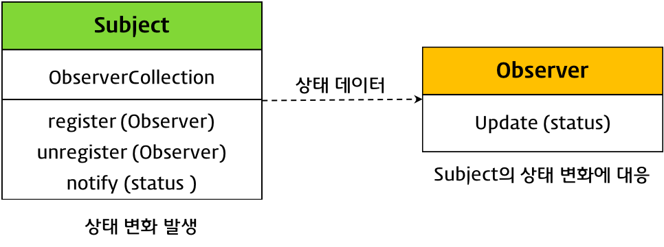
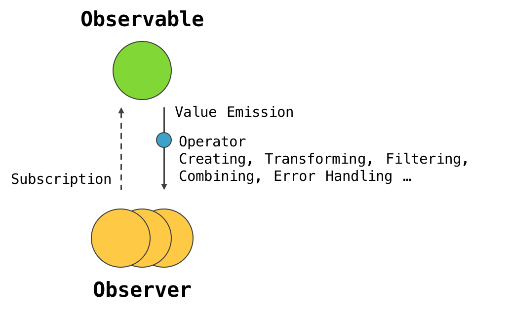
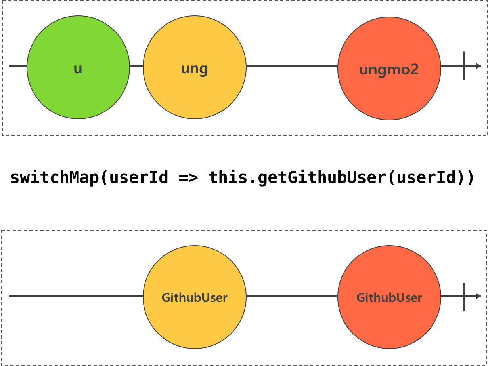

# Reactive Programming(RP)


## intro
- 데이터 스트림의 변화에 반응하는 행위를 정의하는 형태로 작성하는 것을 반응형 프로그래밍이라 한다
- RP는 “모든것이 스트림이다”라는 접근 방식에서 출발한다. 
    - 모든 것을 스트림으로 취급하며 스트림을 구독하고 필요한경우에 가공한다.
- 인터렉티브한 UI를 단순화하기 위해서 고안되었다.
    - MVC패턴에서 모델이 변경되면 그에따라 뷰가 변경되고 뷰가 변경되면 모델에 바로 반영되도록 하기 위함.


RP는 프로그래밍을 데이터 흐름과 그 변화를 알려주는 통지로 바라보는 관점이다.

    비동기 데이터 흐름에 기반을 둔 프로그래밍 패러다임이다. 데이터 흐름은 마치 강과 같아서 이를 관찰하거나 필터링하거나 다룰 수 있으며 새로운 사용자를 위한 새로운 흐름을 만들기 위해 다른 흐름과 병합할 수 있다.
    (Rx자바로 배우는 리액티브 프로그래밍-21p-)


```js
//설치 (CDN)
<script src="https://cdnjs.cloudflare.com/ajax/libs/rxjs/4.1.0/rx.all.min.js"></script>

//예제 데이터 (서버로 요청한 값이라고 가정)
list = [
  {no:1, name: 'lee', age: 15},
  {no:2, name: 'kim', age: 16},
  {no:3, name: 'park', age: 15},
  {no:4, name: 'choi', age: 14}
]

//옵저버블의 생성
var observable = Rx.Observable.from(list)

//옵저버블의 구독
observable
  .subscribe( (result) => {console.log(result)})


//오퍼레이터
observable
  .filter ((result) => result.age==15)
  .subscribe( (result) => {console.log(result)})
```


## 1.first-knowloge

### 스트림


### 옵저버 패턴.
  

     Observer pattern은 객체의 상태 변화를 관찰하는 옵저버들의 목록을 객체에 등록하여 상태 변화가 있을 때마다 메서드 등을 통해 객체가 직접 목록의 각 옵저버에게 통지하도록 하는 디자인 패턴이다.

```ts
type Message = { message: string };

class Subject {
  private _observers: Observer[] = [];
  protected _state: Message = { message: '' };

  // Observer 등록(구독)
  add(observer: Observer) {
    this._observers = [...this._observers, observer];
    console.log('구독', observer);
    console.log('현재 구독 명단', this._observers);
  }

  // Observer 삭제(구독 해지)
  remove(observer: Observer) {
    this._observers 
      = this._observers.filter(o => o !== observer);
    console.log('구독 해지', observer);
    console.log('현재 구독 명단', this._observers);
  }

  // 구독한 모든 Observer의 update 메소드를 호출하여 데이터를 전파
  protected notify(state: Message) {
    this._observers.forEach(o => {
      console.log(`${o.constructor.name}에게 데이터를 전파한다!`, state);
      o.update(state);
    });
  }
}

class MySubject extends Subject {
  // 구독한 모든 Observer에게 메시지를 전파 
  setMessage(message: string) {
    this._state.message = message;
    this.notify(this._state);
  }
}

abstract class Observer {
  // Subject에 의해 호출되어 메시지를 전파받는다.
  abstract update(message: Message): void;
}

class Observer1 extends Observer { 
  update(message: Message) {
    console.log(`${this.constructor.name}에게 데이터가 전파되었다!`, message);
  }
}
class Observer2 extends Observer {
  update(message: Message) {
    console.log(`${this.constructor.name}에게 데이터가 전파되었다!`, message);
  }
}

const subject = new MySubject();
console.log(subject);
const o1 = new Observer1();
const o2 = new Observer2();

// 구독
subject.add(o1);
subject.add(o2);

// 데이터 전파
subject.setMessage('👋');

// 구독 취소
subject.remove(o2);

// 데이터 전파
subject.setMessage('😀');
```


### Reactive X(Rx)
- Rx는 observable 컬렉션들을 이용해 비동기와 이벤트 기반의 프로그램을 작성하기 위한 라이브러리다.
- ReactiveX 는 Observer 패턴, Iterator 패턴, 함수형 프로그래밍을 조합하여 제공한다.
- Observable 시퀀스와 표현력있는 쿼리 연산자를 사용하는 비동기적, 이벤트 기반의 프로그램을 구성하기 위한 라이브러리의 집합
- 비동기 데이털르 처리하는 데 있어서 장점을 갖는다. 
- 생성하고 조합하고 구독한다.


## 2.특징
반응형 프로그래밍은 비동기를 처리하는 하나의 대안이며 다음의 특징을 갖는다.

### 1. 데이터 처리를 일관되게 할 수 있다.
비동기로 처리하는 데이터는 서버 통신결과, 이벤트 콜백 등 유형이 다향하며 유형에 따른 처리방법도 제각각이다.   
반응형 프로그맹은 동기/비동기 관계없이 데이터를 생산하는 것을 일관된 형식의 observable로 만들어고 이를 구독하여 일관되게 처리할 수 있다.


### 2. 요청을 취소할 수 있다.
이 단점은 promise패턴의 단점이다.  
아직 공식적으로 promise요청을 취소할 수 있는 단점이 없는데 Rxjs를 이용하면 취소가 가능하다.

### 3. 연속성을 갖는 데이터를 처리할 수 있다.
데이터 스트림을 다루기 때문에 연속적인 데이터를 다루기 쉽다.


## 3.Observable LifeCycle
1. 생성
- Observble.create();
- 생성시점에는 어떠한 이벤트도 발생되지 않는다.  

2. 구독
- Observable.subscribe();
- 구독시점에 이벤트를 구독할 수 있다.

3. 실행
- Observer.next()
- 실행시점에 이벤트를 구독하고 있는 대상에게 값을 전달한다.  

4. 구독해제
- observer.complete();
- Observable.unsubscribe()
- 구독 해제 시점에 구독하고 있느 모든 대상의 구독을 종료한다.  


## 4.개념


### 4.1 Observer
- 데이터 소비자
- Observable이 방출한 Notification을 전파받아 사용하는 객체
- 데이터 소비자인 Observer는 데이터 생산자인 Observable을 구독한다. 
- 구독에 의해 Observer는 Observable에 연결되어 Observable의 상태를 관찰한다.
- Observable이 방출한 Notification은 Observer에게 자동으로 전파된다.



### 4.2 Observable
- 데이터 생산자
- 데이터 스트림을 생성하고 notification(Observable이 방출할 수 있는 푸시 기반 이벤트 또는 값)을 방출(emit)하는 객체
- 데이터를 생성하는 무엇이든 Observable이 될 수 있다.
- 연속성를 갖는 데이터를 Observer에게 스트리밍한다.
- hot observable : 데이터를 받는 구독자가 없더라도 데이터를 스트리밍한다.
- cold observable: 구독자가 있는 경우에만 스트리밍 데이터를 만들기 시작.
- RX의 observable은  구독자가 있어야 스트리밍 데이터를 만드는 cold observable이다.

**메서드**
1. publish 
```js
    var hotObservable = observable.publish();
```
2. create
```js
var observable = Rx.Observable.create(function (observer) {
    observer.onNext(42);
    observer.onCompleted();
});
```
3. subscribe  
```js
observable.subscribe(onNext, onError, onComplete)
```

*파라미터*  
1. onNext: Observable 구독자에게 데이터를 전달한다.
2. onComplete : Observable구독자에게 완료되었음을 알린다. next는 더이상 데이터를 전달하지 않는다.
3. onError : Observable구독자에게 에러를 전달한다. 이후에 next 및 complate 이벤트가 발생하지 않는다. 

```js
var subscription = observable.subscribe(
    function onNext(value) {
        console.log('Next: %s.', value);
    },
    function onError(ev) {
        console.log('Error: %s!', ev);
    },
    function onComplete() {
        console.log('Completed!');
    }
);

subscription.dispose();
```


### 4.3 subscribe(구독)
- observer가 observable을 관찰하는 행위
- subscribe를 하게 되면 observalble이 notification을 발행할 때 마다 수신하고 가공할 수 있다.

### 4.4 notify
- 데이터 생성자가 구독자에게 데이터가 생성됐음을 알리는 행위.


### 4.5 notification
- 데이터 생성자(Observable)이 방출한 데이터이다.

### 4.6 subject
특수한 형태의 observable로 observable과 observer기능을 동시에 한다고 생각하면 된다.  
subjext는 next를 통해 notification을 방출할 수 있고 observer function을 구독해서 notification을 수신할 수도 있다.  
observable과 차이가 있는데 subject는 여러개의 observer를 동시에 구독할 수 있는데(multicast) 반해 obervable은 하나의 observer에만 구독할 수 있다.(unicast)  

```js
// javascript
const subject = new Subject();
subject.subscribe(
  (item) => console.log('a', item),
  (err) => console.error(err),
  () => console.log('a complete'),
);
subject.subscribe(
  (item) => console.log('b', item),
  (err) => console.error(err),
  () => console.log('b complete'),
);
subject.next('item');
subject.complete();
// a item
// b item
// a complete
// b complete
```


### 4.7 operator


- observable을 파라미터로 받아서 다른 형태의 observabler로 변환해 리턴하는 함수다.  
- observable를 가공하는 기능을 한다고 보면 된다.
- create: 데이터 흐름 생성함수
- map: map 오퍼레이터는 옵저버블이 방출한 데이터를 인자로 전달받는 콜백 함수를 실행하고 그 결과값으로 이루어진 새로운 옵저버블을 반환한다.
- filter: filter 오퍼레이터는 옵저버블이 방출한 데이터를 인자로 전달받는 필터 함수를 실행하여 그 결과값이 true인 값만을 추출한 새로운 옵저버블을 반환한다
- combine: 여러 observable 조합하는 역할
- **mash**
- **split**
- **merge**
- **from**: from 오퍼레이터는 배열과 같은 이터러블(Iterable)을 인자로 전달받아 옵저버블을 생성한다.
- **switchMap**:  switchMap 오퍼레이터는 옵저버블을 받아서 새로운 옵저버블을 생성한다. 
- **debounceTime**:  debounceTime 오퍼레이터는 옵저버블이 방출하는 데이터를 수신하는 시간을 지연시킨다.




### 4.8 schedular  
자바스크립트는 싱글스레드 이벤트 루프로 동작하기 때문에 RxJS에서의 scheduler는 이벤트 루프에 어떤 순서로 처리될지로 구현된다.  

1. AsyncScheduler  
- asyncScheduler.schedule(() => console.log(‘async’), 2000);    
2. AsapScheduler   
asapScheduler.schedule(() => console.log(‘asap’));
다음 이벤트 루프에 실행  
3. QueueScheduler  
스케줄러에 전달된 state 를 처리한다.  

```js
queueScheduler.schedule(function (x) {
  if(state) { this.schedule(state-1) }
  console.log(state);
}, 0, 3)
// 3
// 2
// 1
// 0
```


## 5.예제

### Ex1
- 검색에 따라 stack overflow 검색결과를 stack exchange API를 이용하여 브라우저에 띄운다.
- 불필요한 요청을 방지하기 위해 1초동안 검색에 변화가 없을 경우에만 요청을 보낸다. (디바운싱)
- 이전에 보냈던 요청의 응답이 그 이후 요청의 응답보다 늦게 도착할 경우 무시한다.
- 중복되는 검색어가 연속으로 들어왔을 때 요청을 한 번만 보낸다. 
- 요청이 실패할 경우 자동으로 최대 3번까지 요청을 재시도 한다.

```js
sbj.pipe(filter((value, index) => value !== ''))
            .pipe(debounceTime(1000))
            .pipe(distinctUntilChanged())
            .pipe(switchMap((value:any, index : number) => {
                return ajax.get(`https://api.stackexchange.com/2.2/search?order=desc&sort=activity&intitle=${value}&site=stackoverflow`)
                    .pipe(map(r => r.response.items))
                    .pipe(retry(3))
                }
            ))
            .subscribe(
                (value: any) => {
                    setResult(value);
                },
                (err : any) => setError('error!'),
        );

```


### Ex2
- 1번 부터 10까지 중에서 짝수를 구하여 1을 더해라

```js
range(1, 10).pipe(
  tap(
    (x) => console.log('tap:' + x),
    (err) => console.error(err),
    () => console.log('tap complete')
  ),
  filter(x => !(x % 2)),
  map(x => x + 1),
).subscribe(
  (x) => console.log('subscribe:' + x),
  (err) => console.err(err),
  () => console.log('complete')
);
// tap:1
// tap:2
// subscribe:3
// tap:3
// tap:4
// subscribe:5
// tap:5
// tap:6
// subscribe:7
// tap:7
// tap:8
// subscribe:9
// tap:9
// tap:10
// subscribe:11
// tap complete

```


### Ex3
- 자동완성

```js
function searchFor(text) {
    var xhr = new XMLHttpRequest();
    xhr.open('GET', apibaseUrl + '?q=' + text, true);
    xhr.send();
    return Rx.Observable.fromEvent(xhr, 'load').map(function (ev) {
        var request = ev.currentTarget;

        if (request.status === 200) {
            var response = request.responseText;
            return JSON.parse(response);
        }
    });
}

var q = document.querySelector('#query');
var observable = Rx.Observable.fromEvent(q, 'keyup')
    .debounce(300)
    .map(function (ev) { return ev.target.value; })
    .where(function (text) { return text.length >= 3; })
    .distinctUntilChanged()
    .map(searchFor)
    .switch()
    .where(function (obj) { return obj !== undefined; });
```


### Ex4
- 우편번호를 통해 날씨를 조회
- 각 조회한 우편번호는 화면에 블럭 단위로 추가 된다.
- 추가된 우편번호는 일정시간이 지나면 정보를 업데이트 한다.
- 날씨 정보는 [openweathermap](https://openweathermap.org/)에서 제공하는 오픈 API를 사용한다.
- 우편번호 셈플 (94102, 99501, 32801)


```html
<html lang="ko">
<head>
  <meta charset="UTF-8">
  <title>Weather Monitoring in RxJS</title>
  <style>
  #form {
    margin-bottom: 20px;
  }
  .location {
    float: left;
    padding: 10px;
    margin-right: 20px;
    margin-bottom: 20px;
    border: 1px solid #ddd;
    border-radius: 5px;
  }
  .location p {
    margin-top: 10px;
    margin-bottom: 10px;
    text-align: center;
  }
  .zip { font-size: 2em; }
  .temp { font-size: 4em; }
  </style>
</head>
<body>
  <div id="app-container">
    <div id="form">
      <label>Zip Code:</label>
      <input type="text" id="zipcode-input">
      <button id="add-location">Add Location</button>
    </div>
  </div>
  <script src="https://cdnjs.cloudflare.com/ajax/libs/rxjs/4.1.0/rx.all.min.js"></script>
  <script>
  // our code will go here
  console.log('RxJS included?', !!Rx);
  </script>
</body>
</html>
```
```js
// Grab HTML elements
const appContainer = document.getElementById('app-container');
const zipcodeInput = document.getElementById('zipcode-input');
const addLocationBtn = document.getElementById('add-location');

// Get stream of button clicks
const btnClickStream =
  Rx.Observable
    .fromEvent(addLocationBtn, 'click')
    .map(() => true)
    // .forEach(val => console.log('btnClickStream val', val));


// Get stream of zip codes
const zipInputStream =
  Rx.Observable
    .fromEvent(zipcodeInput, 'input')
    .map(e => e.target.value)
    .filter(zip => zip.length === 5)
    // .forEach(val => console.log('zipInputStream val', val));


// Get zipcode after button clicked
const zipcodeStream =
  btnClickStream
    .withLatestFrom(zipInputStream, (click, zip) => zip)
    .distinct() // 중복 제거
    // .forEach(val => console.log('zipcodeStream val', val));

// Create reusable temperature fetching stream
/**
 *
 * @description 우편번호를 받아 날씨 API에서 온도를 받아오는 요청을 만든다.
 * APPID:https://openweathermap.org/
 */
const getTemperature = zip =>
  fetch(`http://api.openweathermap.org/data/2.5/weather?q=${zip},us&units=imperial&appid=APPID`)
    .then(res => res.json());

/**
 * @description getTemperature으로 부터 스트림을 생성한다.
 */
const zipTemperatureStreamFactory = zip =>
  Rx.Observable
    .fromPromise(getTemperature(zip))
    .map(({ main: { temp } }) => ({ temp, zip }));


// Get new zip at each button click, get its
// temperature, and paint it to the screen
zipcodeStream
  .flatMap(zipTemperatureStreamFactory)
  .forEach(({ zip, temp }) => {
    const locationEle = document.createElement('div');
    locationEle.id = `zip-${zip}`;
    locationEle.classList.add('location');

    const zipEle = document.createElement('p');
    zipEle.classList.add('zip');
    zipEle.innerText = zip;

    const tempEle = document.createElement('p');
    tempEle.classList.add('temp');
    tempEle.innerHTML = `${temp}&deg;F`;

    locationEle.appendChild(zipEle);
    locationEle.appendChild(tempEle);
    appContainer.appendChild(locationEle);

    zipcodeInput.value = '';
  });

// Create stream that can replay all zips at will
const replayZipsStream = new Rx.ReplaySubject();
zipcodeStream.subscribe(replayZipsStream);

// Create a timer to refresh the data
// and update the page
Rx.Observable
  .interval(20000)  // 20초마다 반복해라.
  .flatMapLatest(() => replayZipsStream)        // flatMapLatest은 replayZipsStream이 단일 구독자를 가지는 것을 보장한다.
  .flatMap(zipTemperatureStreamFactory)
  .forEach(({ zip, temp }) => {
    console.log('Updating!', zip, temp);

    const locationEle = document.getElementById(`zip-${zip}`);
    const tempEle = locationEle.querySelector('.temp');

    tempEle.innerHTML = `${temp}&deg;F`;
  });

```


## ref
- [rxjs](https://blog.shiren.dev/2017-01-03-RxJS%EC%99%80-%ED%95%A8%EA%BB%98%ED%95%98%EB%8A%94-%ED%95%A8%EC%88%98%ED%98%95-%EB%A6%AC%EC%95%A1%ED%8B%B0%EB%B8%8C-%ED%94%84%EB%A1%9C%EA%B7%B8%EB%9E%98%EB%B0%8D/)
- [rxjs in angular](https://poiemaweb.com/angular-rxjs)
- [rxjs란](https://velog.io/@dvmflstm/RxJS-Practice)
- [why rx](https://zeddios.tistory.com/689)
- [반응형 프로그래밍과 RxJS 이해하기](https://hyunseob.github.io/2016/10/09/understanding-reactive-programming-and-rxjs/)