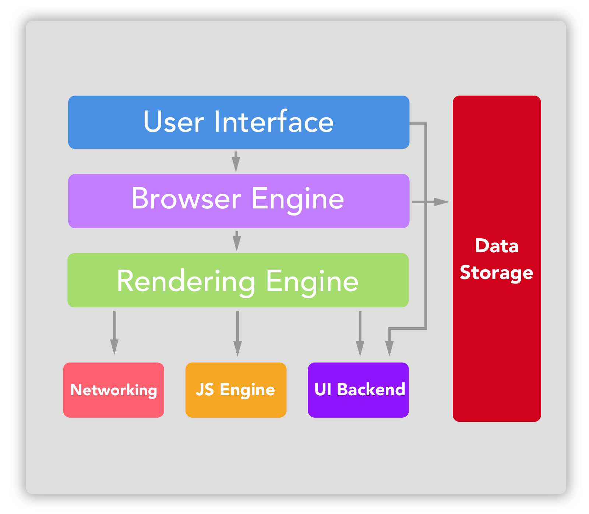
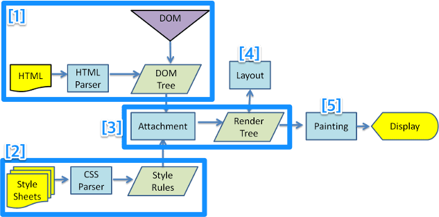
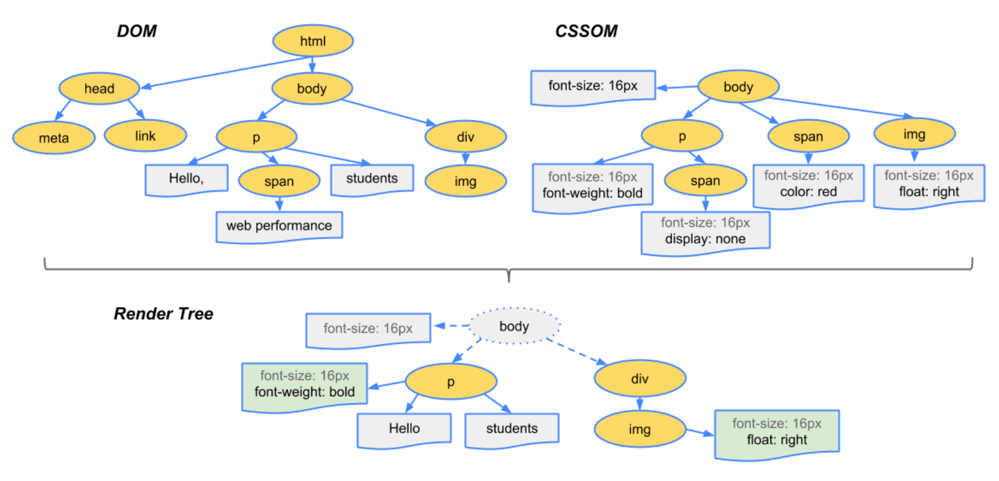

## broweser rendering process


## intro
브라우저 렌더링과정을 간략하게 정리해보자.

## 브라우저 구조

1. 사용자 인터페이스   
주소 표시 줄, 이전/다음 버튼, 홈버튼, 새로 고침 / 정지 버튼 등 요청한 페이지를 보여주는 창 외의 사용자가 컨트롤 할 수 있는 부분을 일컫는다.
2. 브라우저 엔진  
사용자 인터페이스와 렌더링 엔진 사이의 동작을 제어한다.

3. 렌더링 엔진   
요청한 URI를 브라우저에서 받아 콘텐츠를 표시해준다. HTML을 요청하면 HTML과 CSS를 파싱하여 창에 보여준다.
4. 네트워킹  
HTTP 요청과 같은 네트워크 처리를 담당하는 부분, 이 부분은 독립적인 인터페이스라 각 플랫폼의 하부에서 (OS) 실행된다.
5. 자바스크립트 엔진  
자바스크립트를 해석하고 실행
6. 데이터 저장소  
이 부분은 자료를 저장하는 계층이다. 쿠키 등의 자료가 들어가 있으며, 자료는 컴퓨터의 하드디스크에 저장된다. HTML5에서는 더 쉽게 사용할 수 있도록 웹 데이터베이스를 사용할 수 있도록 지원한다.
7. UI 백엔드
콤보상자나 윈도우와 같은 기본적인 위젯을 그리기 위해 사용된다.  


## 렌더링이란?
논리적인 문서의 표현식을 그래픽 표현식으로 변형시키는 과정.  
다시 말해 서버로부터 받은 컨텐츠(HTML, CSS, JS등)을 변환하여 화면에 픽셀단위로 나타내는 과정이다.


1. DOM(Document Object Model ) 생성
2. CSSOM(CSS Object Model) 생성
3. Render Tree(DOM + CSSOM) 생성
4. Render tree 배치 (레이아웃팅)
5. reder tree 그리기 (페인트)


## 렌더링 과정
HTTP 요청 후 응답을 통해 구현되는 브라우저 처리 과정을 설명한다.  


위 프로세스는 크롬에 사용된 웹킷 엔진의 렌더링 과정이다.  
렌더링 엔질별 차이가 있겠으나 편의상 웹킷을 기준으로 설명한다. 


### 1. DOM(Document Object Model) 생성


브라우저는 HTML문서를 받아오면 렌더링 엔진이 파싱해서 Dom tree를 생성한다. 
DOM은 문서를 객체 모델로 표현한 방식이다.
각 태그는 DOM 요소로 1:1로 대응해 표현되며 DOM 요소 노드는 트리 형태로 구성된다. 이를 DOM 트리라고 한다.  
DOM 트리는 다음 네 단계를 거쳐 생성된다.  
1. conversion  
html의 raw bytes형태로 서버에서 받아온다. 해당 파일의 인코딩에 따라 문자로 변환한다.  
2. Tokenizing  
브라우저가 변환된 문자열을 HTML표준에 따라 고유 토큰으로 변환한다.
3. lexing  
이 토큰들은 다시 각각의 특성과 규칙을 정의한 객체 노드로 변화된다.  
4. dom생성  
HTML마크업이 여러 태그 간의 관계를 나타내기 떄문에 DOM은 트리구조를 가진다. 따라서 DOM에 포함된 노드 또한 서로 관게를 가지게 된다. 다시 말해 노드의 상대적인 관계를 이용하면 하나의 노드를 기준으로 모든 노드에 접근할 수 있다.  

### 2.CSSOM(CSS Object Model) 생성

스타일 정보를 통해 스타일 구조체(Style struct)를 생성한다.  
스타일 정보는 단계적으로 처리되며 가장 마지막 단계의 스타일 정보가 이전 스타일보다 우선으로 적용된다. 스타일 정보가 처리되는 단계는 다음과 같다.

1. 브라우저 자체에 포함된 기본 스타일 (User Agent)
2. 사용자 정의 스타일 외부파일 또는 내부 스타일
```html
<!-- external style -->
<link rel="stylesheet" type="text/css" href="/css/main.css">

<!-- internal style --> 
<style type="text/css">     
    body { background-color:#ffffff; background-image:none; background-reapeat:repeat; } 
</style>
```
3. HTML 태그에 스타일 속성을 사용해 기술되는 인라인 스타일.
```html
<!-- inline style --> 
<div style="display:block"> </div>
```


### 3.Render Tree(DOM + CSSOM) 생성 - Attachment

DOM 트리와 스타일 구조를 기반으로 렌터트리를 생성한다.
렌더트리는 DOM과 1:1 대응하지 않는데 스타일이 반영되어 화면에 실제 표현되는 노드로 구성된다.  
예를 들어 `display:none `속성이 있는 노드는 렌더트리에 포함되지 않는다.  

또 일부 노드(`<head>`, `<title>`, `<script>` 등)는 화면에 표현되는 노드가 아니므로 DOM 트리의 구성원이지만 렌더 트리의 구성원은 아니다.  

렌더 트리에서 각 노드는 프레임이나 박스로 불리며 CSS박스 속성 정보가 있다.  

- CSSOM 역시 트리 구조를 가지는데, 그 이유는, ‘하향식’으로 규칙을 적용하기 때문이다. 루트(body)부터 시작해서, 트리를 만들어 가는 방식이다.


### 4. Latout
렌더 트리의 각 노드를 문서에서 정확하게 배치되도록 위치를 계산한다.  
이 과정은 CSS 비주얼 렌더링 모델(Css visual redering model)에 의해 제어되며 루트에서 하위 노드로 반복되어 진행된다.  

브라우저는 레이아웃 게산을 출력되는 화면의 해상도보다 높은 해상도로 처리한다.  
그렇기 때문에 사용자가 화면을 확대 또는 축소했을때 추가적인 계산없이 원본 크기 상태의 픽셀 좌표값과 매칭해 배울에 상관없이 올바르게 배치할 수 있다.  

### 5.Paint
렌더링 엔진은 요소가 어디에 표현돼야 할지 알고 있으므로 렌더 트리를 순회하면서 페인트 함수를 호출해 노드를 하면에 표현한다.  


## 리플로와 리페인트
초기 렌더링 이후에 사용자 인터렉션이나 페이지의 기능에 따라 화면의 일부 영역이 변경될 때 리플로와 리페인트가 발생한다.  
예를 들어 레이어 전환이나 ajax요청을 통해 DOM이 수정되거나 style요소가 변경되는 경우가 이런 경우다.  

이런 작업이 발생하면 렌더트리를 변경해야해서 리플로 또는 리페인트가 발생한다.  

### 1. 리플로
변경이 필요한 렌더 트리에 대한 유표성 확인 작업과 함께 노드의 크기와 위치를 다기 계사하는것을 말한다.  
리플로 또는 레이아웃, 레이아웃팅이라 부른다.  
좀 더 정확히는 노드의 크기나 위치가 변경되어 현재 레잉아웃에 영향을 미쳐 재배치를 해야할 때 리플로가 발생한다.  

특정 요소에 리플로가 발생하면 DOM 구조에 따라 자식 요소와 부모요소를 다시 계산될 수 있으며, 경우에 따라 문서 전체에 리플로가 발생할 수도 있다.


### 2. 리페인트
변경 영역의 결과를 표현하기 위해 화면이 업데이터 되는 것을 의미한다. 리플로가 발생하거나 배경색 변경등의 단순한 스타일 변경과 같은 작업이 발생하는 경우다. 간단하게는 화면을 변경해야 할 때 ㅅ발생한다고 생각하면 된다. 이러한 작업을 리페인트또는 리드로우라고 한다.  

리플로와 리페인트 모두 처리비용이 발생하지만 리페인트보다 리플로의 비용이 훨씬 높다. 리플로는 변경 범위에 따라 전체 페이지의 레이아웃을 변경해야할 수도 있기 대문이다. 어느 경우든 리플로와 리페인트 때문에 UI의 화면 표현이 느려자 사용자 경험에 영향을 줄수 있음으로 렌더링 최적화기 필요하다.  

**발생요인**  
현재 구성 렌더 트리의 변경을 가져오는 작업이 실행되면 작업의 종류에 따라 리플로 또는 리페인트가 발생한다.
- DOM 노드의 변경: 추가, 제거 업데이트
- DOM 노드의 노출 속성 변경 : display:none은 리플로, 리페인트를 발생시키지만 visibility:hidden 은 레이아웃이 유지됨으로 리페인트만 발생한다.
- 스크릅트 애니메이션: 애니메이션은 DOM 노드의 이동과 스타일 변경이 짧은 시간 내에 수차례 반복해 발생되는 작업이다.
- 스타일 : 새로운 스타일 시트의 추가 등을 통한 스타일 정보 변경 또는 기존 스타일 규칙의 변경
- 사용자 액션 : 브라우저 크기 변경, 글꼴 크기 변경


## 렌더링 과정확인하기. 
리플로와 리페인트 발생과정을 직접 확인해 볼수 있습니다.  
크롬에서 렌더링 처리는 세가 지 상태로 표현됩니다.
1. Reclculate Style: 요소의 스타일값을 재계산하는 단계
2. Layout:리플로가 발생하는 단계
3. Paint: 변경된 요소를 화면에 표현하는 단계


렌더 트리의 변경으로 인한 리플로와 리페인트는 비용이 많이든다. 브라우저는 내부적으로 비용을 줄이기 위해 이러한 작업을 지금 당장 실행하지 않거나 나중에 실행하도록 미루는 방법으로 최적화 합니다.  
관련 작업을 큐에 쌓고 일정 시간 또는 일정 수의 작업이 쌓인 이후에 배치로 관련 작업을한 번에 처리해서 여러번 발생할 수 있는 리플로를 한 번으로 줄입니다. 하지만 요소의 특정 속성이나 메서드를 이용해 값을 요청하는 것만으로도 이 같은 브라우저의 최적화 작업을 중단시킬 수 있습니다.  

보통 브라우저는 값을 반환하도록 요청받으면 요소의 최신 상태정보가 반영된 값을 반환한다. 그러나 해당 시점에 큐에 쌓인 작업이 요청된 요소의 스타일 정보에 영향을 줄 수도 있ㄷ으므로 브라우저는 먼저 큐에 있는 작업을 모두 실행하고 나서 요청된 값을 반환하빈다.  이렇게 되면 결좌적으로 특정 속성과 메섣를 실행하는 것만으로도 추가적인 피플로를 발생시킬 수 있습니다.  

다음은 브라우저의 리플로 최적화 실행을 중단하고 추가적인 리플로를 발생시키는 것으로 알려진 객체의 속성과 메서드다.  

1. HTMLElement  
clientHeight, clientLeft, clientTop, clientWidth, focus(), getBoundingClientRect(), getClientRects(), innerText, offsetHeight, offsetLeft, offsetParent, offsetTop, offsetWidth, outerText, scrollByLines(), scrollByPages(), scrollHeight, scrollIntoView(), scrollIntoViewIfNeeded(), scrollLeft, scrollTop, scrollWidth 

2.  Frame, Image
height, width 

3. Range  
getBoundingClientRect(), getClientRects() 

4. SVGLocatable  
computeCTM(), getBBox()

5. SVGTextContent   
getCharNumAtPosition(), getComputedTextLength(), getEndPositionOfChar(), getExtentOfChar(), getNumberOfChars(), getRotationOfChar(), getStartPositionOfChar(), getSubStringLength(), selectSubString() 

6. window  
 getComputedStyle(), scrollBy(), scrollTo(), scrollX, scrollY, webkitConvertPointFromNodeToPage(), webkitConvertPointFromPageToNode() 


## ref
- [브라우저의 데이터 요청정](https://medium.com/@pks2974/website%EB%8A%94-%EC%96%B4%EB%96%BB%EA%B2%8C-%EB%B3%B4%EC%97%AC%EC%A7%80%EA%B2%8C%EB%90%98%EB%8A%94-%EA%B1%B8%EA%B9%8C-1-108009d4bdb)
- [브라우저의 문서 표현과정](https://medium.com/@pks2974/website%EB%8A%94-%EC%96%B4%EB%96%BB%EA%B2%8C-%EB%B3%B4%EC%97%AC%EC%A3%BC%EA%B2%8C-%EB%90%A0%EA%B9%8C-f1193c844480)
- [1](https://memory.today/dev/36)
- [2](https://janghanboram.github.io/2018/06/06/browser-rendering/)
- [3](https://boxfoxs.tistory.com/408)
- https://12bme.tistory.com/140
- [4](https://yceffort.kr/2019/08/12/how-browser-work/)
- [브라우저는 어떻게 동작하는가?](https://setisigns.tistory.com/422?category=428631)
- [d2-브라우저 동작원리](https://d2.naver.com/helloworld/59361)