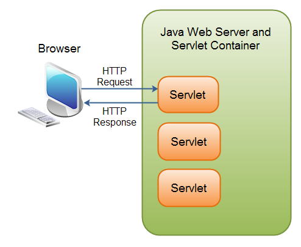

# Servlet

## 0. 등장배경.
Servlet의 등장을 거슬러 올라가면 CGI에 대해 알아야한다.

**CGI (Common Gateway Interface)** 
웹이 정적 웹을 넘어서 사용자와의 인터렉션을 통한 동적기능을 지원하기 위해 웹 서버 상에서 다른 프로그램을 불러내서 처리한뒤, 처리결과를 클라이언트에게 보내줄 인터페이스가 필요해졌다.
그래서 등장한 것이 CGI다. 
*cf.* CGI의 종류: mod perl, mode php, FastCGI  

CGI 프로그램은 웹 서버에서 프로세스 단위로 실행 된다. 
그러다보니 사용자 요청이 많아졌을 때 서버 부하가 커지고 프로세스 보다 작은 단위로 실행하는 것이 필요해졌다. 
그리고 웹 서버의 프로세스로서 인터프린터를 상주시키고 CGI로 부터 프로그램을 호출해 서버의 부하를 줄임으로서 서버 성능을 개선한 Java Sevlet 등장했다. 즉 DB통신으로 인한 dom변화처럼 동적 웹을 위해 등장한 기술이다.

## 1. 정의
Servlet은 Thread단위로 CGI프로그래밍을 지원함으로서 동적인 웹을 지원하는 기술이다. 
기존 프로세스 단위의 CGI에서 Tread단위로  실행되어 서버의 부하를 줄었고 기존의 CGI프로그래밍에서 직접 코드에 설정을 추가해 줘야했던 단점이 사라짐으로서 간편해졌다. 
HTTP 프로토콜 서비스를 지원하는 javax.servlet.http.HttpServlet 클래스를 상속받아. 클라이언트 요청을 처리한다. 

## 2. 한계
Servlet을 이용한 동적 웹페이지를 만들기 위해서 java 소스코드에 HTML이 들어간다. 
이 점은 가독성, 유지보수, 개발 모든 면에서 불편함을 초래했다. 
예를 들면 테스트를 하기 위해 servelt를 빌드해야한다. 
또 Veiw와 비지니스 로직이 섞여있기 때문에 유지보수에 치명적이다. 
이러한 단점을 보완하기 위해 JSP가 등장했다. 
JSP의 등장으로 프리젠테이션 로직과 비지니스로직이 완전히 분리되면서 Servlet은 순수하게 Controller의 역할을 수행하게 되었다. 

## 3. LifeCycle

### 3.1 Init
클라이언트의 HTTP요청이 들어오면 컨테이너는 해당 서블릿이 메모리에 있는지 확인하고, 없을 경우 init()메소드를 호출한다.
Servlet Container는 HttpServlet, HttpServletResponse 두 객체를 생성한다.
클라이언트가 요청한 URL을 DD(Deplyment Descriptor)를 참조해서 분석하여 어느 Servlet에 대한 요청인지 찾는다.
여 적재한다.
init()메소드는 처음 한번만 실행되기 때문에, 서블릿의 쓰레드에서 공통적으로 사용해야하는 것이 있다면 오버라이딩하여 구현하면 됩니다. 실행 중 서블릿이 변경될 경우, 기존 서블릿을 파괴하고 init()을 통해 새로운 내용을 다시 메모리에 적재한다.

### 3.2 Service
init()이 호출된 후 클라이언트의 요청에 따라서 service()메소드를 통해 요청에 대한 응답이 doGet()가 doPost()로 분기된다. 
doGet()또는 doPost()메소드는 동적인 페이지를 생성한 후 HttpServbletResponse 객체에 응답을 보낸다. 
이때 서블릿 컨테이너가 클라이언트의 요청이 오면 가장 먼저 처리하는 과정으로 생성된 HttpServletRequest, HttpServletResponse에 의해 request와 response객체가 제공된다.
응답이 완료되면 HttpServbletResponse, HttpServbletRequest 두 객체를 소멸시킨다.

### 3.3 Destroy
컨테이너가 서블릿에 종료 요청을 하면 destroy()메소드가 호출되는데 마찬가지로 한번만 실행되며, 종료시에 처리해야하는 작업들은 destroy()메소드를 오버라이딩하여 구현하면 됩니다.

**배포서술자**
웹 컨테이너에게 클라이언트가 접근한 URL이 Servlet임을 인식하고 그 Servlet을 처리할 class의 위치를 정의한다.

## 4. Servlet Container

- 서블릿을 관리해주는 컨테이너
- 클라이언트의 요청을 받아주고 응답을 할 수 있게, 웹서버와 소켓을 만들어 통신한다.

### 4.1 서블릿 컨테이너의 역할
1. 웹서버와의 통신 지원 
서블릿 컨테이너는 서블릿과 웹서버가 손쉽게 통신할 수 있게 해줍니다. 일반적으로 우리는 소켓을 만들고 listen, 
accept 등을 해야하지만 서블릿 컨테이너는 이러한 기능을 API로 제공하여 복잡한 과정을 생략할 수 있게 해줍니다.
그래서 개발자가 서블릿에 구현해야 할 비지니스 로직에 대해서만 초점을 두게끔 도와줍니다.

2. 서블릿 생명주기(Life Cycle) 관리  
서블릿 컨테이너는 서블릿의 탄생과 죽음을 관리한다. 서블릿 클래스를 로딩하여 인스턴스화하고, 
초기화 메소드를 호출하고, 요청이 들어오면 적절한 서블릿 메소드를 호출한다. 
또한 서블릿이 생명을 다 한 순간에는 적절하게 Garbage Collection(가비지 컬렉션)을 진행하여 편의를 제공한다.

3. 멀티쓰레드 지원 및 관리  
서블릿 컨테이너는 요청이 올 때 마다 새로운 자바 쓰레드를 하나 생성하는데, HTTP 서비스 메소드를
실행하고 나면, 쓰레드는 자동으로 죽게됩니다. 원래는 쓰레드를 관리해야 하지만 서버가 다중 쓰레드를
생성 및 운영해주니 쓰레드의 안정성에 대해서 걱정하지 않아도 됩니다.

4. 선언적인 보안 관리  
서블릿 컨테이너를 사용하면 개발자는 보안에 관련된 내용을 서블릿 또는 자바 클래스에 구현해 놓지 않아도 됩니다.
일반적으로 보안관리는 XML 배포 서술자에 다가 기록하므로, 보안에 대해 수정할 일이 생겨도 자바 소스 코드를 
수정하여 다시 컴파일 하지 않아도 보안관리가 가능한다.
 

 

* 웹 어플리케이션
* 웹 컨테이너

