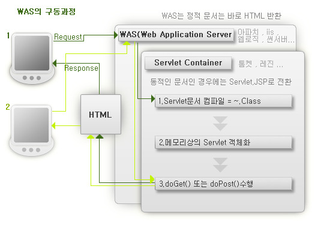
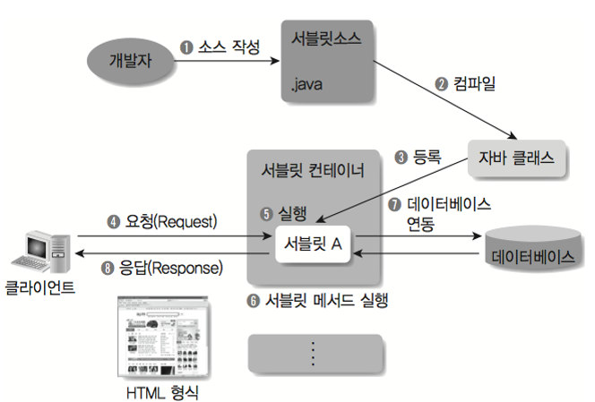

# Servlet


## 0. 등장배경.
Servlet의 등장을 거슬러 올라가면 CGI에 대해 알아야한다.


**CGI (Common Gateway Interface)**<br>
웹이 정적 웹을 넘어서 사용자와의 인터렉션을 통한 동적기능을 지원하기 위해 웹 서버 상에서 다른 프로그램을 불러내서 처리한뒤, 처리결과를 클라이언트에게 보내줄 인터페이스가 필요해졌다.
그래서 등장한 것이 CGI다.<br>
*cf.* CGI의 종류: mod perl, mode php, FastCGI <br>


CGI 프로그램은 웹 서버에서 프로세스 단위로 실행 된다.<br>
그러다보니 사용자 요청이 많아졌을 때 서버 부하가 커지고 프로세스 보다 작은 단위로 실행하는 것이 필요해졌다.<br>
그리고 웹 서버의 프로세스로서 인터프린터를 상주시키고 CGI로 부터 프로그램을 호출해 서버의 부하를 줄임으로서 서버 성능을 개선한 Java Sevlet 등장했다. 즉 DB통신으로 인한 dom변화처럼 동적 웹을 위해 등장한 기술이다.


## 1. 정의


Servlet은 Thread단위로 CGI프로그래밍을 지원함으로서 동적인 웹을 지원하는 기술이다.<br>
기존 프로세스 단위의 CGI에서 Tread단위로  실행되어 서버의 부하를 줄었고 기존의 CGI프로그래밍에서 직접 코드에 설정을 추가해 줘야했던 단점이 사라짐으로서 간편해졌다.<br>

Server + Applet의 합성어로 서버에서 실행되는 Applet이란 의미로
자바를 이용하여 웹에서 실행되는 프로그램을 작성하는 기술을 말한다.<br>
WAS에서 제공하는 HttpServelt Class를 상속받은 Class<br>

-----

멀티 쓰레딩에 의해 사용자 요구를 처리하고 가공해서 이에 대한 결과를 내보내게 된다 CGI가 클라이언트를 프로세스로 처리한데 반해
서블릿은 클라이언트를 쓰레드로 처리한다 많은 클라이언트의 요구를 효과적으로 처리할 수 있다.
서블릿 객체는 여러 개의 쓰레드가 돌아가면서 처리하기 때문에 서블릿 메서드들은 반드시 멀티 쓰레드에 대한 고려를 해야한다.

자바언어를 기반으로 동적인 컨텐츠를 생성하는 기술. 자바 프로그램 작성하는 형식과 거의 같다.
자바 코드안에 HTML태그갓 섞여있어 작업에 대한 분리적인 측면으로 볼 때 효율성이 떨어진다.
프로그래머가 프로그래밍하기 어려우며 수정하기 어려운 단점이 있다

-----

-서블릿은 자바에 HTML을 삽입한다. 동적으로 웹을 개바할 때 사용하는 기반 기술로서 웹에서 자바 프로그래밍을 할 수 있다.
	-자바를 사용하여 웹페이지를 동적으로 생성하는 서버측 프로그램 혹은 그 사양을 말한다.
 	서블릿은 웹 서버의 성능을 향상하기 위해 사용하는 자바클래스의 일종이다. 서블릿은 jsp와 비슷한 점이 있지만 jsp가 hTML문서 안에
	java코드를 포함하고 있는 반면 서블릿은 자바코드 안에 html을 포함하고 있다는 차이가 있다.

	-자바 코드를 서블릿 규약에 맞게 작성하고, 코드를 컴파일 해서 클래스 파일을 만들어 웹 어플리케이션으로 실행될 수 있는 위치에 배포하면 된다.

	-자용자 입력에 따라 DB와 연동하는 프로그램들은 서버에서 실행될 필요가 있다.(화면에서도 가능하다)
	 이런것들은 CGI를 이용하여 구현하게 된다.
	 그러나 서버에서 실행되는 자바 가상머신을 이용하면 그러한 프로그램들은 자바 언어로 구현 할 수 있따.
	 서버에 있는 서블릿의 장점은 CGI응용프로그램보다 더 빠르게 실행될수 있단느것이다.
	
	-서블릿은 각 사용자 요청마다 별도의 프로세스가 생기는 대신, 단 하나의 데몬 프로세스 내에서 스레드로 호출된다.
	 이는 각 요구에 따른 시스템 오버헤드가 적다는 얘기다.

	-초기화된 서블릿이 클라이언트의 요청이 있을 떄마다 쓰레드를 생성해서 병렬적으로 서비스를 수행한다
	(멀티스레드를 사용하기 때문에, 서블릿 객체는 여러개 생성되지 않는다)

	-서블릿은 Was를 통해 컴파일 된 후 메모리에 적재되어 클라이언트의 HTTP Get Post등의 요청을 처리하는 자바프로그램이다.


-----

## 2. 장단점

### 2.1 장점
- java를 기반으로 하므로 java API를 모두 사용할 수 있다.
- 쓰레드를 기반으로 하므로 웹 어플리케이션 서버 자원을 효율적으로 활용할 수있따.
- 웹어플리케이션에서 효율적인 자료 공유방법을 제공한다.
- 비지니스로직과 프리젠테이션 로직을 분리할 수 있다.
- 컨트롤러와 뷰의 역할을 분담으로 인해 웹 디자인너오 ㅏ개발자 간의 효율적인 업무 분담 가능
- 유지보수에 수월	
- 기능 확장에 용이
- 서블릿 컨텍스트 리스너 및 필터 서블릿 등 고급 프로그래밍 기법을 통해 보다 효과적인 웹어플리케이션 설계 가능

### 2.2 한계
Servlet을 이용한 동적 웹페이지를 만들기 위해서 java 소스코드에 HTML이 들어간다.<br>
이 점은 가독성, 유지보수, 개발 모든 면에서 불편함을 초래했다.<br>
예를 들면 테스트를 하기 위해 servelt를 빌드해야한다.<br>
또 Veiw와 비지니스 로직이 섞여있기 때문에 유지보수에 치명적이다.<br>
이러한 단점을 보완하기 위해 JSP가 등장했다.<br>
JSP의 등장으로 프리젠테이션 로직과 비지니스로직이 완전히 분리되면서 Servlet은 순수하게 Controller의 역할을 수행하게 되었다.<br>


## 3. LifeCycle




### Servelet 실행방식
일반적인 자바 클래스를 실행하기 위해서는 main 메소드가 있는 클래스에서 객체를 생성하여 실행해야한다. 하지만 서블릿은 이런 방식으로 실행되지 않고 웹서버가 실행해주는 독특한 방식을 갖는다.<br>
서블릿은 **Event-Driven Rpogrammin**으로 사용자의 요청이 들어오면 동작을 시작한다. 요청이 들어오면 웹 애플리케이션 서버가 서블릿 객체를 생성한 후에 init()메소드를 호출 후 요청 방식에 따라 do Get() 혹은 doPost() 메소드를 호출 한다.<br>


## 생명주기
- 처음 load되면 init()메서드가 실행된다.
- init()메서드에서는 servlet이 서비스하기 위해 필요한 코기화 작업을 수행하고 service 메서드를 호출한다.
- 초기화된 servlet은 클라이언트의 요청이 있을 때마다 쓰레드가 생성이 되어서 병행적으로 servlet()메서드를 실행한다.
- Servlet은 더 이상 서비스를 하지 않을 경우에는 Servlet 엔진에 의해 메모리에서 unloadehlsek.
- 이 때 unload되기 전에 destory()method가 실행된다.
- service(0 method는 0회 이상 실행되고 init() method는 여러 번 실행될 수 있지만 그 전에 destory() method가 실행되어야 한다.


### 3.1 Init
클라이언트의 HTTP요청이 들어오면 컨테이너는 해당 서블릿이 메모리에 있는지 확인하고, 없을 경우 init()메소드를 호출한다.
Servlet Container는 HttpServlet, HttpServletResponse 두 객체를 생성한다.
클라이언트가 요청한 URL을 DD(Deplyment Descriptor)를 참조해서 분석하여 어느 Servlet에 대한 요청인지 찾는다.
여 적재한다.
init()메소드는 처음 한번만 실행되기 때문에, 서블릿의 쓰레드에서 공통적으로 사용해야하는 것이 있다면 오버라이딩하여 구현하면 됩니다. 실행 중 서블릿이 변경될 경우, 기존 서블릿을 파괴하고 init()을 통해 새로운 내용을 다시 메모리에 적재한다.

### 3.2 Service
init()이 호출된 후 클라이언트의 요청에 따라서 service()메소드를 통해 요청에 대한 응답이 doGet()가 doPost()로 분기된다.<br>
doGet()또는 doPost()메소드는 동적인 페이지를 생성한 후 HttpServbletResponse 객체에 응답을 보낸다.<br>
이때 서블릿 컨테이너가 클라이언트의 요청이 오면 가장 먼저 처리하는 과정으로 생성된 HttpServletRequest, HttpServletResponse에 의해 request와 response객체가 제공된다.
응답이 완료되면 HttpServbletResponse, HttpServbletRequest 두 객체를 소멸시킨다.

### 3.3 Destroy
컨테이너가 서블릿에 종료 요청을 하면 destroy()메소드가 호출되는데 마찬가지로 한번만 실행되며, 종료시에 처리해야하는 작업들은 destroy()메소드를 오버라이딩하여 구현하면 됩니다.


**배포서술자**
웹 컨테이너에게 클라이언트가 접근한 URL이 Servlet임을 인식하고 그 Servlet을 처리할 class의 위치를 정의한다.


## 4. Servlet Container




- 서블릿을 관리해주는 컨테이너
- 클라이언트의 요청을 받아주고 응답을 할 수 있게, 웹서버와 소켓을 만들어 통신한다.

### 4.1 서블릿 컨테이너의 역할
1. 웹서버와의 통신 지원<br>
서블릿 컨테이너는 서블릿과 웹서버가 손쉽게 통신할 수 있게 해줍니다. 일반적으로 우리는 소켓을 만들고 listen, 
accept 등을 해야하지만 서블릿 컨테이너는 이러한 기능을 API로 제공하여 복잡한 과정을 생략할 수 있게 해줍니다.
그래서 개발자가 서블릿에 구현해야 할 비지니스 로직에 대해서만 초점을 두게끔 도와줍니다.

2. 서블릿 생명주기(Life Cycle) 관리 <br>
서블릿 컨테이너는 서블릿의 탄생과 죽음을 관리한다. 서블릿 클래스를 로딩하여 인스턴스화하고, 
초기화 메소드를 호출하고, 요청이 들어오면 적절한 서블릿 메소드를 호출한다. 
또한 서블릿이 생명을 다 한 순간에는 적절하게 Garbage Collection(가비지 컬렉션)을 진행하여 편의를 제공한다.


3. 멀티쓰레드 지원 및 관리 <br>
서블릿 컨테이너는 요청이 올 때 마다 새로운 자바 쓰레드를 하나 생성하는데, HTTP 서비스 메소드를
실행하고 나면, 쓰레드는 자동으로 죽게됩니다. 원래는 쓰레드를 관리해야 하지만 서버가 다중 쓰레드를
생성 및 운영해주니 쓰레드의 안정성에 대해서 걱정하지 않아도 됩니다.


4. 선언적인 보안 관리 <br>
서블릿 컨테이너를 사용하면 개발자는 보안에 관련된 내용을 서블릿 또는 자바 클래스에 구현해 놓지 않아도 됩니다.
일반적으로 보안관리는 XML 배포 서술자에 다가 기록하므로, 보안에 대해 수정할 일이 생겨도 자바 소스 코드를 
수정하여 다시 컴파일 하지 않아도 보안관리가 가능한다.
 
### 4.2 서블릿 컨테이너의 동작 원리

1. 브라우저에서 서블릿을 요청한다.
2. 그러면 웹 서버가 서블릿 요청을 인식하고 서블릿 컨테이너 에게 서블릿을 수행하도록 넘겨준다.
3. 서블릿은 스레드를 기동하여 해당 서블릿 객체를 생성하여 이를 수행한다.
4. 서블릿 객체의 작업이 종료되면 기동되었던 스레드가 종료된다.
5. 서블릿 수행 결과가 웹 서버에 전송된다.
6. 이를 클라이언트에 전송한다.


	
### 쓰레드 처리과정
1) 클라이언트의 서비스 요청(객체 생성유무체크)
2) 서블릿이 서버에 로드되어있지 않다면 객체를 생성하여 메모리에 적재한다.
3) Invoker에서 생성된 쓰레드에서 클라이언트당 1개의 쓰레드를 생성한다ㅣ.
4) 결과를 클라이언트에게 보낸다. 이때 mime type으로 보내는데 웹브라우저의 mime type은 text/html이다.

*컨테이너는 객체 생성의 유, 무를 체크해서 객체가 생성되지 않으면 생성한다.


### 셈플
```java
public class HelloServlet extends HttpServlet {

	public void doGet(HttpServletRequest req,HttpServletResponse res)

			throws ServletException,IOException {

		res.setContentType("text/html;charset=UTF-8");

		PrintWriter out = res.getWriter();
		out.println("<HTML>");
		out.println("<BODY>");
		out.println("Hello World!!");
		out.println("</BODY>");
		out.println("</HTML>");
		out.close();

	}


```


-----
동작과정


*서블릿 동작과정
	*Servlet Container
		-웹 서버는 servlet 자체를 시행하지 못하므로 java 가상머신을 내장한 서블릿 컨테이너(서블릿 엔진)이라는 실행환경이 필요하다
		-Tomcat은 웹 서버 기능을 가지고 있으므로 주 역할은 Servlet container이다.
		

	*클라이언트 요청에 따른 서블릿 동작
		1) 컨테이너는 서블릿 클래스를 메모리에 적재하여 상주시킨다.
		2) 서블릿 클래스의 생성자 메소드를 호출해 인스턴스를 생성하여 메모리에 적재한다.
		3)생성된 인스턴스는 init()메소드가 호출된다. inti() 메소드는 Servlet 생명주기에서 단 한먼만 실핸된다.
			따라서 init() 메서도에서는 각종 초기화 적업 등을 수행한다.
		4)Servlet에 대한 사용자 요청에 대해서는 web.xml 파일을 참조해 url 맵핑을 확인하고 해당 servlet 인스턴스로 부터 스레드를 생성하여
		 service() 메소드를 호출한다. 모든 사용자 요청에 대해 개별적인 serviece() 메소드가 호출되며 GET 또는 POST 요청을 구분하여
		doGET() 또는 DoPost()메소드에 대부분 필요한 기능을 구현한다.
		5) destory() 메소드는 Servlet 인트턴스가 더이상 존재할 이유가 없어서 메모리에서 소멸될 떄 호출된다.
		 이러한 상황에 필요한 작업이 있따면 이 메소드에 관련 내용을 구현한다.


------
