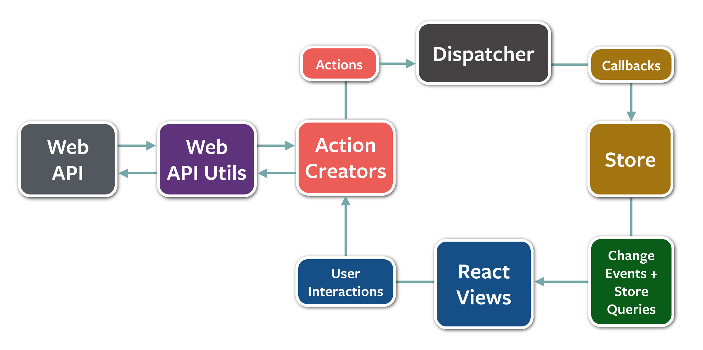

# Flux


## intro
Facebook이 MVC패턴의 양방향 데이터 바인딩 구조에서 야기될 수 있는 시스템 복잡도를 해결하고자 고안한 단방향 시스템 아키텍쳐이다.  


## 데이터 흐름

양방향 데이터 바인딩은 연속적인 갱신이 발생하고 객체 하나의 변경이 다른 객체를 변경하게 되어 실제 필요한 업데이트보다 더 많은 분량을 실행하게 된다.  
어플리케이션의 규모가 커지면 데이터의 연속적인 갱신이 되는 상황에서는 사용자 상호작용의 결과가 어떤 변화를 만드는지 예측하는데 어려워진다.  

그래서 데이터는 단방향으로만 흐르고, 새로운 데이터를 넣으면 처음부터 흐름이 다시 시작되는  아키텍처를 개발했다.  
 


## 구성

### Action creator
모든 변경사항과 사용자와의 상호작용이 거쳐가야 하는 액션을 생성한다.  
애플리케이션의 상태를 변경하거나 뷰를 업데이트하고 싶다면 액션을 생성해야만 한다.  
컴포넌트가 어떤 메시지를 보낼지 알려주면 액션 생성자는 나머지 시스템이 이해할 수 있는 포맷으로 바꿔준다.  
액션 생성자가 액션 메시지를 생성한 뒤에는 디스패쳐(dispatcher)로 넘겨준다.
```js
// action object
{
    type: INCREASE,
    payload: {
        ...
    }
}
```

### Dispatcher
디스패쳐는 기본적으로 콜백(callback)이 등록되어있는 곳이다. 디스패쳐는 액션을 보낼 필요가 있는 모든 스토어(store)를 가지고 있고, 액션 생성자로부터 액션이 넘어오면 여러 스토어에 액션을 보낸다.  
이 처리는 동기적으로(synchronously) 실행된다. 만약 스토어들 사이에 의존성(dependency)이 있어서 하나를 다른 것보다 먼저 업데이트를 해야한다면, `waitFor()`를 사용해서 디스패쳐가 적절히 처리하도록 할 수 있다.  

flux의 디스패쳐는 액션 타입과는 관계없이 등록된 모든 스토어로 보내진다. 이말인 즉슨, 스토어가 특정 액션만 구독(subscribe)하지 않고 모든 액션을 일단 받은 뒤 처리할지 말지를 결정한다는 뜻이다.

### Stores
Store는 어플리케이션의 상태와 상태 변화로직을 포함하고 있다.  
모든 상태 변경은 반드시 스토어에 의해서 결정되어야만 하며, 상태 변경을 위한 요청을 스토어에 직접 보낼 순 없다.  
스토어가 디스패쳐에 등록되어 있다면, 모든 액션을 받게 될 것이다. 스토어의 내부에서는 보통 switch statement를 사용해서 처리할 액션과 무시할 액션을 결정하게 된다. 만약 처리가 필요한 액션이라면, 주어진 액션에 따라서 무엇을 할 지 결정하고 상태를 변경하게 된다.

일단 스토어에 상태 변경을 완료하고 나면, 변경 이벤트(change event)를 내보낸다. 이 이벤트는 컨트롤러 뷰(the controller view)에 상태가 변경했다는 것을 알려주게 된다.


### Views(React 컴포넌트), controller-view
뷰는 상태를 상태를 가져오고 유저에게 보여주고 입력받을 화면을 렌더링하는 역할을 맡는다.  
뷰는 애플리케이션 내부에 대해서는 아는 것이 없지만, 받은 데이터를 처리해서 사람들이 이해할 수 있는 포맷(HTML)으로 변경하여 보여주는 역할만 수행한다.  

컨트롤러 뷰는 스토어와 뷰 사이의 중간관리자같은 역할을 한다.  
상태가 변경되었을 때 스토어가 그 사실을 컨트롤러 뷰에게 알려주면, 컨트롤러 뷰는 자신의 아래에 있는 모든 뷰에게 새로운 상태를 넘겨준다.


## How to use 
### 준비
1. 스토어는 디스패쳐에 액션이 들어오면 알려달라고 말해둔다.
2. 컨트롤러 뷰는 스토어에게 최신 상태를 묻는다.
3. 스토어가 컨트롤러 뷰에게 상태를 주면 렌더링하기 위해 모든 자식 뷰에게 상태를 넘겨준다.
4. 컨트롤러 뷰는 스토어에게 상태가 바뀔 때 알려달라고 다시 부탁한다.


## 데이터 흐름



1. 뷰는 액션 생성자에게 액션을 준비하라고 말한다.
2. 액션 생성자는 액션을 포맷에 맞게 만들어서 디스패쳐에 넘겨준다.
3. 디스패쳐는 들어온 액션의 순서에 따라 알맞은 스토어로 보낸다. 각 스토어는 모든 액션을 받게 되지만 필요한 액션만을 골라서 상태를 필요에 맞게 변경한다.
4. 상태 변경이 완료되면 스토어는 자신을 구독(subscribe)하고 있는 컨트롤러 뷰에게 그 사실을 알린다.
5. 연락을 받은 컨트롤러 뷰들은 스토어에게 변경된 상태를 요청한다.
6. 스토어가 새로운 상태를 넘겨주면, 컨트롤러 뷰는 자신 아래의 모든 뷰에게 새로운 상태에 맞게 렌더링하라고 알린다.


### REF
- [the-case-for-flux](https://medium.com/swlh/the-case-for-flux-379b7d1982c6)
- [Flux overview-kor](https://haruair.github.io/flux/docs/overview.html)
- [Flux.io](http://facebook.github.io/flux/docs/in-depth-overview)
- [what-the-flux-lets-redux](https://blog.andyet.com/2015/08/06/what-the-flux-lets-redux/)
- [redux-kr](https://lunit.gitbook.io/redux-in-korean/)
- [페이스북이Flux를채택한이유](https://blog.coderifleman.com/2015/06/19/mvc-does-not-scale-use-flux-instead/)
- [Flux와 Redux](https://taegon.kim/archives/5288)
- [FLUX카툰으로이해하기](https://bestalign.github.io/2015/10/06/cartoon-guide-to-flux/)
- [Flux and MVC](https://beomy.tistory.com/44)
- [redux_cartton_korean](http://bestalign.github.io/2015/10/26/cartoon-intro-to-redux/)
- [redux 적용기](https://d2.naver.com/helloworld/1848131)
- [actions-and-the-dispatcher](https://haruair.github.io/flux/docs/actions-and-the-dispatcher.html#content)