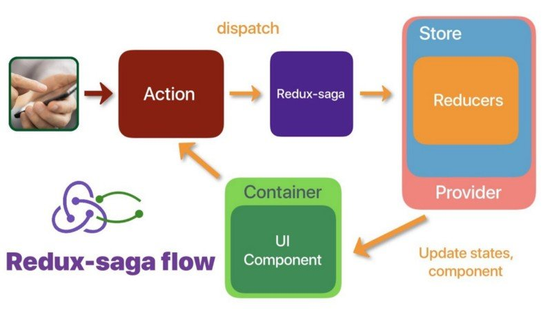

# redux-saga

## Intro
왜 saga를 써야 할까요?  
saga는 쉽게 말해 쉽게 말해 이벤트 리스너라고 할 수 있습니다.  
액션을 모니터링하다가 액션이 발생하면 액션에 따라 자바스크립트를 실행하거나 다른액션을 디스패치하는 등의 방식으로 동작합니다.  

지금 thunk를 사용하고 있더라도 saga를 써야하는 이유는 충분합니다. 
thunk에서 못했던 작업들이 가능해졌기 때문입니다.  
1. 비동기 작업을 할 때 기존 요청을 취소 처리 할 수 있습니다.
2. 특정액션이 발생 했을때 이에 따라 다른 액션이 디스패치되게끔 하거나 자바스크립트 코드를 실행할 수 잇습니다.
3. 웹소켓을 사용하는 경우 Channel이라는 기능을 사용하여 더욱 효율적으로 코드관리를 할수 있습니다.
4. API 요청을 실패했을 때 재요청하는 작업을 할수 있습니다.
5. 순차적 액션 dispatch
6. Action을 모아서 dispatch하고 싶다.
7. 다른 프레임워크, 라이브러리와 잘 어울리게 하고 싶다
8. 재사용이 가능해진다
9. 더 작은 코드로 분할할 수 있다.
10. 병렬처리
11. 동기적 구조에서 오는 테스트의 용이성

이 장점들을 종합하면 `사이드 이펙트 관리`라는 말로 정리 할 수 있습니다.  
여기서 사이드 이펙트란 순수하지 않은 함수에서 발생하는 예상 밖의 동작을 말하는데 예를 들어 비동기 작업, 브라우저 캐시등이 있습니다.  함수가 일관된 결과를 보장하지 못하거나, 함수 외부 어디든지 조금이라도 영향을 주는 경우 모두 사이드 이펙트를 갖습니다.  
이런 사이드 이펙트에 대한 관리를 redux-saga에 몰아줌으로서 다른 부분들은 순수한 형태로 유지 할 수 있습니다.  
결과적으로 redux-saga도입하면 액션 생성자와 리듀서가 순수 함수 형태로 돌아갑니다.  
Saga의 관심은 오로지 애플리케이션의 변수로 작용 할 여지가 있는 작업(사이드 이팩트)의 관리에 있습니다.


## redux-thunk의 한계
- action에게 과도한 책임을 준다는 점
- 그 책임으로 인해 action을 나타내는 코드를 이해하기 힘든 상태로 만든다

리덕스 사가는 액션에 위임된 책임을 수행하여 action과 리듀에서 발생하는 사이드 이펙트를 제거한다.

## 용어
1. effect  
이펙트는 사가의 미들웨어가 실행할 명령들을 포함하고 있는 평범한 자바스크립트 객체이다.

2. task  
테스크는 백그라운드에서 실행되는 프로세스와 같다. 리덕스 사가 기반의 애플리케이션은 여러 테스크들을 병렬로 실행시킬 수 있다. fork 함수를 통해 이러한 테스크들을 생성할 수 있다.

3. non-blocking  
블로킹 호출은 Saga가 이펙트를 yield 하면 실행에 대한 결과를 기다렸다가 제네레이너 내부에서 다음의 명령어의 실행을 재개한다.
논블로킹 호출은 Saga가 이펙트를 yield한 이후 바로 실행을 재개한다는 것을 의미한다.  

4. watcher/worker  
- watcher: 디스패치된(dispatched) 액션을 관찰하고 모든 액션에 대해 워커(worker)를 포크합니다.
- worker: 액션을 처리하고 종료합니다.


## Effect

### Select
state에서 필요한 데이터를 꺼낸다

### Put
액션을 디스패치한다.
```ts
function* writePostSaga (){
  try {
    yield put({
      type: WRITE_POST_REQUEST,
      payload: post
    })
  } catch(e){
    console.error(e.stack)
    yield put({
      type: WRITE_POST_FAILURE,
      payload: e
    })
  }

}

```


### Task
비동기 액션이 dispatch되는 것을 기다린다.
```js
yield take([ADD_CART, REMOVE_CART, CLEAR_CART]);
const cart = yield select(selectCart);
localStorage.setItem('cartCache', JSON.stringify(cart));
```


### call
프로미스 완료를 기다린다


### fork
다른 task를 실헹한다
```js
export function* initDeliveryAt() {
  while (true) {
    yield take(LOAD_AVAILABLE_DATES);
    yield fork(initAvailableDatesFlow);
  }
}
...
​
export function* initAvailableDatesFlow() {
  ...
}

```
### join 
다른 task종료를 기다린다

### taskEvery
모든 액션마다 실행된다

### taskLatest
액션 호출시에 같은 액션이 실행 중이면 그 액션은 파기되고 마지막 호출만 실행됩니다. POST, PUT, DELETE 같은 리소스 변경 메소드에 사용합니다.


### all
사가 함수를 동시에 실행한다.
```ts
function* rootSaga() {

    yield console.log('[SYSTEM] rootSaga created')

    yield all([
        fork(baseSaga),
        fork(editorSaga),
        fork(postSaga),
    ])
}
```


## 병렬 이펙트

## Flow



## Q&A


# ref
- [TDD-saga](https://www.vobour.com/00-redux-saga-)
- [redux-saga-interview](https://survivejs.com/blog/redux-saga-interview/)
- [saga-book-kor](https://mskims.github.io/redux-saga-in-korean/introduction/BeginnerTutorial.html)
- [saga-docs](https://redux-saga.js.org/docs/introduction/BeginnerTutorial.html)
- [Redux-Saga: 사이드 이펙트 관리](https://meetup.toast.com/posts/136)
- [Redux-Saga: 제너레이터와 이펙트](https://meetup.toast.com/posts/140)
- [from-redux-thunk-to-sagas](https://medium.com/@deeepakampolu/from-redux-thunk-to-sagas-2896c0abc676#.ptlov4222)
- [thunk and saga](https://ideveloper2.tistory.com/53)
- [saga](https://react.vlpt.us/redux-middleware/10-redux-saga.html)
- [thunk와 saga비교해봅시다.](https://velog.io/@dongwon2/Redux-Thunk-vs-Redux-Saga%EB%A5%BC-%EB%B9%84%EA%B5%90%ED%95%B4-%EB%B4%85%EC%8B%9C%EB%8B%A4-)
- [deal-with-async-process- by-redux-saga](https://github.com/reactkr/learn-react-in-korean/blob/master/translated/deal-with-async-process-by-redux-saga.md)
- [Managing process in redux using sagas](https://jaysoo.ca/2016/01/03/managing-processes-in-redux-using-sagas/)
- [redux and middleware](https://medium.com/humanscape-tech/redux%EC%99%80-%EB%AF%B8%EB%93%A4%EC%9B%A8%EC%96%B4-thunk-saga-43bb012503e4)
- [Managing side effects in react + redux usin sagas](https://jaysoo.ca/2016/01/03/managing-processes-in-redux-using-sagas/)
- [why do we need middleware for async flow in redux](https://stackoverflow.com/questions/34570758/why-do-we-need-middleware-for-async-flow-in-redux/34599594#34599594)
- [TDD wiwh Redux-Saga](https://www.vobour.com/00-redux-saga-)