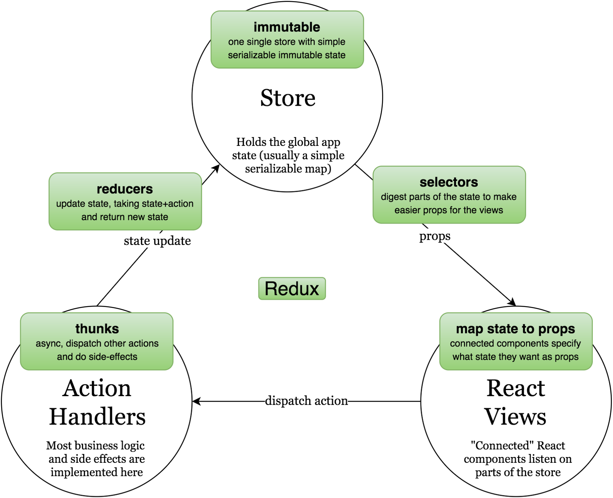

# redux


FLUX 아키텍쳐를 편하게 사용할 수 있게 해주 상태관리 라이브러리.
그리고 react-redux는 리액트에서 redux를 쉽게 사용하기 위한 라이브러리다.  
redux를 사용함으로서 기존의 구조에서 컴포넌트간 상태전달을 위해서 직계 부모를 거쳐 전달하는 상태관리의 단점을 극복할 수 있다.  
redux를 이해하기 위해서 몇가지 용어를 이해해야한다.  


## 소개 
Redux는 Javascript 어플리케이션에서 data-state와 UI-state를 관리해주는 도구입니다. 이는 상태적 데이터 관리가 시간이 흐름에 따라 복잡해질수 있는 Single Page Applicatoin에서 유용하게 사용됩니다.

React는 데이터흐름이 단방향으로 흐릅니다. 하지만 컴포넌트 갯수가 많아진다면 혹은 데이터를 교류할 컴포넌트들이 parent-child관계가 아니라면 이런 단방향 데이터 전달은 복잡해집니다.

  
물론 직계 부모 컴포넌트를 이용하여 데이터를 전달 하는 방법이 있지만 이런 방법은 코드를 복잡하게 만듭니다.  

React Document에서 제시하는 조언은 다음과 같습니다.
    For communication between two components that don’t have a parent-child relationship, you can set up your own global event system. … Flux pattern is one of the possible ways to arrange this.
글로벌 이벤트 시스템, React Document에서 제시하는 방법은 Flux 패턴입니다.

<br><br>


### #Flux 패턴
  
한마디로 하면 Flux는 애플이케이션 내의 데이터 흐름을 단방향(single directional data flow)으로 흐룰 수 있도록 도와주는 시스템 아키텍쳐입니다.  
시스템에서 어떠한 Action을 받았을 때 Dispatch가 받은 Actoin들을 통제하여 Store에 있는 데이터를 업데이트합니다. 그리고 변동된 데이터가 있으면 View에 리렌더링합니다.  
View에서는 Action을 Dispatcher에 보내서 Store에 저장된 상태값을 변경합니다.  
Store는 애플리케이션의 모든 데이터를 관리합니다. Dispatcher는 MVC의 Controller를 대체하며 어떠한 Action이 발생했을 때 어떻게 Store가 관리중인 데이터를 변경할지 결정합니다.  
Store가 갱신될때 View도 동시에 갱신됩니다.  

Flux를 이용하면 시스템의 컴포넌트 간 데이터 흐름이 단방향으로 유지됩니다. 데이터는 단방향으로만 흐르고 각각 Store와 View는 직접적인 영향을 주지 않기 때문에 여러개의 Store나 View를 갖는 시스템도 하나의 Store나 View를 갖는 시스템과 갖다고 볼 수 있습니다.

다음은 페이스북 깃허브에서 발췌한 Dispatcher와 Store의 관계에 대한 설명이다.

    Distpatcher와 Store
    Dispatcher는 Flux 아키텍처의 모든 데이터 흐름을 관리하는 중앙 허브다. 이는 본질적으로 Store 내에서 콜백을 등록할 때 사용하는 장소다. 각 Store는 Dispatcher에 등록할 콜백을 제공한다. 이 Dispatcher가 발생시킨 Action에 응답할 때 애플리케이션 내의 모든 Store는 Dispatcher에 등록한 콜백을 통해 Action에 의해 생긴 데이터를 송신한다.

    등록된 콜백을 정해진 순서로 실행하여 Store간의 의존관계를 관리할 수 있으므로 애플리케이션이 커질수록 더욱 중요하다. 선언에 따라 Store는 다른 Store의 갱신이 완료돌때까지 기다린 다음 자기 자신을 갱신한다.

    Store는 애플리케이션의 상태나 논리를 포함한다. Store의 역할은 전통적인 MVC의 Model역할과 비슷하다. 하지만 다수 객체의 상태를 관리하는 MVC와 달리 단일 객체인스턴스로 관리한다. 또 Backbone 프레임워크의 컬렉션과도 다르다. ORM형식의 객체를 집합으로 관리하기보다 조금 더 단순하게 애플리케이션 내의 한 특정 도메인에 관한 애플리케이션의 상태를 관리한다.


;
Dispatcher가 중첩되지 않게 처리해야합니다. 즉 어떤 Action을 Dispatcher를 통해 처리하는 동안 다른 Action이 동작하지 않아야합니다.

<br><br><br>


## Rule

### 1.Single Source of Truth
Redux는 어플리케이션의 state를 한개의 store에서 관리합니다. 모든 state가 한곳에 있기 때문에 이를 `Single Source of Truth`라고 부릅니다.  
여기서 Flux와 차이가 있는데 Flux에서는 여러개의 store를 갖습니다. store의 데이터 구조는 개발자 나름입니다. 보통 nested된 구조로 이루어져있습니다(중첩구조)


### 2. State is read-only
    "The only way to mutate the state is to emit an action, an object describing what happend."
즉 어플리케이션에서 `setState()`같은 메서드를 이용해 직접 state를 변경하면 안됩니다. state를 변경하기 위해서는 action이 dispatch되어야합니다.
```js
dispatch({type:'INCREASE'})
```


### 3. Chages are made with Pure Functoins
두번째 원칙에서 설명된것처럼 Redux에선 어플리케이션에서 state를 직접 변경하는 것을 허용하지 않습니다. 그대신 action객체를 dispatch하여 상태값을 변경해야합니다. 
이 과정에서 받아온 action객체를 처리하는 함수를 Reducer라고 합니다. Store에서 관리중인 state를 실질적으로 바꿔주는 역할을 하는 함수죠. action이 하는 일은 어떤 변화가 일어나야하는지 알려주는 역할뿐입니다.  

세번째 원칙은 Reducer함수는 '순수함수'로 작성되어야 한다는 겁니다.  

#### 순수함수
- 외부 네트워크 혹은 데이터베이스에 접근하지 않아야한다.
- return 값은 오직 parameter값에만 의존해야한다.
- 인수는 변경되지 않아야한다.
- 같은 인수로 실행된 함수는 언제나 같은 결과를 반환해야한다.
- 순수하지 않은 API 호출을 하지 말아야한다.


## 개념

1. Store
    - 어플리케이션의 상태값을 저장한다.
    - 모든 상태값을 담고 있다.
    - 컴포넌트는 직접 교류하지 않고 store에 저장된 상태값을 공유함으로서 교류한다.


2. Action
    - 상태를 변화시킬 때 참조하는 객체
    - 일으킬 변화에 대한 명세가 담겨있다고 볼 수있다.

3. Dispatch
    - 스토어에 액션 객체를 전달하는 과정
    - 스토어를 구독중정인 컴포넌트에 변화가 생기면 액션객체을를 디스패치를 통해 스토어에 전달한다.
    - ex) store.dispatch(action);

4. Reducer
    - 리듀서 : 변형하는 것
    - 리덕스 내에서 변화를 일으키는 함수
    - 액션객체를 기반으로 상태변경을 결정한다.
    - 상태관리 데이터가 변형되었을때 리듀서가 실행되며 이때 실행에 대한 상세 명세는 액션객체를 따른다.

5. Subscription
    - 상태값을 Store를 통해 관리가 필요한 컴포넌트는
    Store를 구독(Subscription)한다.
    - 상태값이 변경되면 스토어를 구독중인 컴포넌트를 리랜더링한다.
    - 정확하게는 전달받은 리스너를 호출한다.
    - 이 리스너를 통해서 컴포넌트를 새롭게 변경된 상태값을 받고 리랜더링한다.
    - store.subscribe(listener);

   
## 요약

1. 스토어는 애플리케이션의 상태값을 관리한다.
2. 컴포넌트는 상태값 관리를 위해 스토어를 구독합니다.
3. 컴포넌트는 상태값 변경이 필요한 이벤트를 발생했을때
스토어에 저장된 상태값을 수정하기 위해서 스토어에게
store.dispatch(액션생성함수)로 알린다.
4. dispatch를 통해 액션정보를 전달받은 스토어는 리듀서를 실행하여
액션타입에 따라 상태값은 변화시킨다.
5. 상태값을 변화하면 구독중인 컴포넌트에게 알린다.
(정확히는 컴포넌트를 리스너(랜더링하는 함수)를 스토어에 등록(구독)하고 상태값의 변화가 생겼을때 리스너를 실행시킨다.)


# 기술 발전 이력



1. 페이스북이 MVC대신에 FLUX 아키텍쳐를 선택한 이유
2. FLUX 라이브러리 redux
3. redux를 편하게 사용하기 위한 react-redux, react-actions
4. 객체 불변성을 편리하게 구현하기 위한 immulate.js
5. 미들웨어를 사용하기 위한 react-thunk
6. Promiss기분의 비동기 통신을 위한  라이브러리 axios


### REF
- [왜 redux를 써야할까](https://velog.io/@velopert/Redux-1-%EC%86%8C%EA%B0%9C-%EB%B0%8F-%EA%B0%9C%EB%85%90%EC%A0%95%EB%A6%AC-zxjlta8ywt)
- [페이스북이Flux를채택한이유](https://blog.coderifleman.com/2015/06/19/mvc-does-not-scale-use-flux-instead/)
- [MVC패턴의한계](https://taegon.kim/archives/5288)
- [FLUX카툰으로이해하기](https://bestalign.github.io/2015/10/06/cartoon-guide-to-flux/)
- [Redux를이용한데이터교류방법](https://velopert.com/1225)
