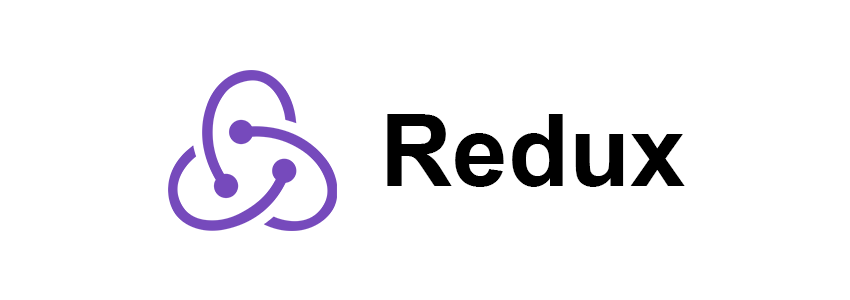
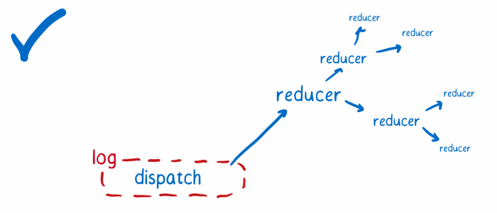
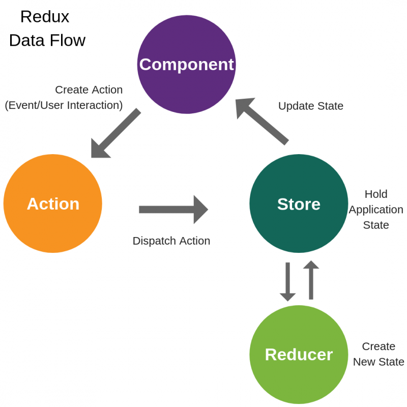

# Redux





## intro


Redux는 Javascript 어플리케이션에서 data-state와 UI-state를 관리해주는 상태관리 라이브러리입니다. 
이는 상태 데이터 관리가 시간이 흐름에 따라 복잡해질수 있는 Single Page Applicatoin에서 유용하게 사용됩니다.  

React는 데이터흐름이 단방향으로 흐릅니다.  
하지만 컴포넌트 갯수가 많아진다면 혹은 데이터를 교류할 컴포넌트들이 부모-자식관계가 아니라면 이런 단방향 데이터 전달은 복잡해집니다.

  
물론 직계 부모 컴포넌트를 이용하여 데이터를 전달 하는 방법이 있지만 이런 방법은 코드를 복잡하게 만듭니다.  

React Document에서 제시하는 조언은 다음과 같습니다.

    For communication between two components that don’t have a parent-child relationship, you can set up your own global event system.
    … Flux pattern is one of the possible ways to arrange this.

글로벌 이벤트 시스템, React Document에서 제시하는 방법은 [Flux](./flux.md) 패턴입니다.  
그런데 Dan Abramov는 Flux를 두고 왜 redux를 개발했을까요?
(참고: [why-use-redux-over-facebook-flux](https://stackoverflow.com/questions/32461229/why-use-redux-over-facebook-flux/32920459#32920459))

  Note: 이 글은 flux에 대한 이해를 전제로 합니다.  


## Flux와 Redux는 무엇이 다른가?


Dan Abramov는 Flux에서 몇가지 불편한점과 부족한 기능을 찾앗습니다
1. hot reloading
2. time travel debugging
3. Undo/Redo 
4. Server Rendering

이런 문제를 해결하기 위해 리덕스를 만들었는데 몇가지 문제를 얘기해 보겠습니다.


### 1.스토어의 코드는 애플리케이션 상태를 삭제하지 않고는 리로딩(reloading)이 불가능하다
Flux에서 스토어(store)는 다음의 두 가지를 포함합니다.
1. 상태 변환을 위한 로직
2. 현재 애플리케이션 상태

스토어 하나가 이 두 가지를 가지고 있는 것은 핫 리로딩을 할 때 문제점가 됩니다.  
새로운 상태 변환 로직(state change logic)을 위해 스토어를 리로딩하면 스토어에 저장되어있는 기존의 상태까지 잃어버리는 데다가 스토어와 시스템의 나머지 부분 사이에 있는 이벤트 구독(event subscription)까지 망가져 버린다.


### SOLUTION: 스토어의 기능 분리
 한 객체는 애플리케이션 상태만을 가지게 하고, 이 객체는 리로딩하지 않도록 하자.  
 또 다른 객체는 모든 상태 변환 로직을 가지도록 하자.  
 이 객체는 상태를 가지고 있지 않으므로 걱정없이 리로딩 할 수 있을 것이다.


### 2. 애플리케이션 상태는 매 액션마다 재기록된다
time travel debugging을 위해서는 상태 객체의 모든 버전들을 기록해두어야 한다. 그걸 가지고 쉽게 이전 상태로 돌아갈 수 있다.  

상태가 새로 바뀔 때마다 이전 애플리케이션 상태를 저장하는 배열에 추가할 필요가 있다.  하지만 JavaScript의 동작방식 때문에 단순히 상태를 가진 변수를 배열에다가 추가하는 것만으로는 부족하다. 이 방식으로는 애플리케이션 상태의 스냅샷(snapshot)을 생성하는게 아니라 같은 객체를 가리키는 새로운 포인터(pointer)를 만들 뿐이다.  
제대로 동작하게 만들기 위해서는, 각각의 버전이 완벽히 독립된 객체가 될 필요가 있다. 그러면 이전 상태들이 실수로 수정되는 일은 일어나지 않을 것이다.


### SOLUTION:불변성(immutable)
액션이 스토어로 전달되었을때 기존의 애플리케이션 상태를 수정하는 대신, 그 상태를 복사한 뒤 복사본을 수정하면 된다.  
새로운 객체를 생성하여 레퍼런스를 변경해야한다.
<br><br><br>


### 3. 서드파티 플러그인(third-party plugin)이 들어갈 좋은 장소가 없다.
개발자 도구에 확장성을 부여하기 위해선  기존의 코드에 서드파티 플러그인을 추가할 수 있는 장소인 확장점(extension point)이 필요하다.  
그렇지 않으면 기존 소스를 수정해야 하기 때문이다.  

예를 들어 로깅(logging)이 있다.  
매 액션마다 console.log()를 실행한다고 가정해보면, 액션이 들어왔을 때 그 액션의 결과로서 만들어지는 새로운 상태를 로깅할 것이다. Flux에서는 디스패쳐(dispatcher)의 업데이트와 각 스토어의 업데이트를 구독(subscribe)해야만 한다.  
하지만 이것은 서드파티 모듈(third-party module)이 쉽게 할 수 있는 것이 아니다.


### SOLUTION:
기존 시스템을 감싸서 새로룬 기능을 부여하는 구조로 변경되어야 합니다.  
다시말해 독립적인 미들웨어(third-party module)을 기존 기능에 쉽게 추가 할수 있어야 합니다.  

상태 변환 로직(state change logic)을 트리구조로 표현하면 다음과 같다.  
이런 구조를 취하게 되면 모든 상태 트리가 처리 된 뒤에 상태가 변했다는 것을 뷰에게 알리기 위해 스토어는 이벤트 한번만 보내면 된다.
  
log(미들웨어)가 dispatch를 감싸고 있다


<br/><br/>
## 3 Rule of Redux

### 1. Single Source of Truth (single store)
Redux는 어플리케이션의 state를 한개의 store에서 관리합니다. 모든 state가 한곳에 있기 때문에 이를 `Single Source of Truth`라고 부릅니다.  
여기서 Flux와 차이가 있는데 Flux에서는 여러개의 store를 갖습니다. store의 데이터 구조는 개발자 나름입니다. 보통 nested된 구조(중첩구조)로 이루어져있습니다

- Undo/Redo 구현이 간단해 집니다. store에 관리중인 상태값을 변경하면 되기 때문입니다.
- 전체 상태값을 불러오기 쉬워집니다.
- 디버깅이 쉬워집니다. 리덕스의 [Time Travel](https://camo.githubusercontent.com/47a3f427c9d2e0c763b74e33417b3001fe8604b6/68747470733a2f2f73332e616d617a6f6e6177732e636f6d2f662e636c2e6c792f6974656d732f3149335032323243334e3252314d3279314b33622f53637265656e2532305265636f7264696e67253230323031352d31322d3232253230617425323030372e3230253230504d2e6769663f763d3162363236376537)기능을 이용하면 디버깅이 쉽습니다.


### 2. State is read-only
    "The only way to mutate the state is to emit an action, an object describing what happend."
즉 어플리케이션에서 `setState()`같은 메서드를 이용해 직접 state를 변경하면 안됩니다. state를 변경하기 위해서는 action이 dispatch되어야합니다.
```js
dispatch({type:'INCREASE'})
```
상태 변경의 경로가 단순하므로 애플리케이션의 동작을 이해하기 쉽습니다. 


### 3. Chages are made with Pure Functoins
두번째 원칙에서 설명된것처럼 Redux에선 어플리케이션에서 state를 직접 변경하는 것을 허용하지 않습니다. 그대신 action객체를 dispatch하여 상태값을 변경해야합니다. 
이 과정에서 받아온 action객체를 처리하는 함수를 Reducer라고 합니다. Store에서 관리중인 state를 실질적으로 바꿔주는 역할을 하는 함수죠. action이 하는 일은 어떤 변화가 일어나야하는지 알려주는 역할뿐입니다.  

세번째 원칙은 Reducer함수는 '순수함수'로 작성되어야 한다는 겁니다.  

- 발생한 액션을 순서대로 기억하고 있으며 언제든지 현재 상태를 만들어 낼 수 있습니다. 리플레이 기능을 쉽게 구현할 수 있습니다.
- 단위테스트 코드를 작성하기 쉽습니다. 정해진 입력에는 항상 예상되는 출력을 주므로 테스트 코드 작성이 쉽습니다.

#### 순수함수란?
- 외부 네트워크 혹은 데이터베이스에 접근하지 않아야한다.
- return 값은 오직 parameter값에만 의존해야한다.
- 인수는 변경되지 않아야한다.
- 같은 인수로 실행된 함수는 언제나 같은 결과를 반환해야한다.
- 순수하지 않은 API 호출을 하지 말아야한다.

## 어떤 데이터를 redux에서 관리해야할까?
- 애플리케이션의 여러 곳에서 공유되는 데이터
- 다른 페이지를 갔다가 돌아왔을 때 그 상태를 유지할 필요가 있는 데이터


## 개념
Flux에대해서 학습했다고 가정하고 차이에 중점을 두어 설명한다.


### 1.Action creators
Flux에서 액션 생성자와 동일하다.  
애플리케이션 상태를 바꾸고 싶다면 반드시 액션을 보내야만 한다.  
어떤 메시지를 보내고 싶은지 액션 생성자에게 알려주면 나머지 시스템이 이해할 수 있는 포맷으로 바꿔준다.  
Flux와는 다르게 Redux의 액션 생성자는 디스패쳐(dispatcher)로 액션을 보내지는 않는다. 대신, 포맷을 바꾼 뒤 액션을 돌려준다.


### 2. Store
모든 상태 변화는 스토어에 의해서 이루어져야 하고 스토어로 직접 요청하는 대신 액션 파이프라인을 따라가야 한다.  
여기까지는 동일하지만 Redux의 스토어는 Flux와 약간 부분이 있다.  

Flux에서는 다수의 스토어를 가질 수 있다. 각 스토어는 각자의 범위를 갖고 그 내부의 모든 컨트롤을 가진다. 그리고 애플리케이션 상태 중 한 조각을 가지고 있고, 그 상태 조각과 관련된 모든 변환 로직을 가진다.  

반면 Redux의 스토어는 하나이며 가존의 기능이 분산되었다.  
Redux의 스토어는 상태 트리(state tree)를 보관하고 액션이 들어왔을 때 어떤 상태변화가 필요한지에 대한 일은 리듀서(reducer)에 위임한다.
 

### 3.reducers
스토어는 액션이 어떤 상태 변화를 해야할지 알기 위해서 액션과 현재 상태를 리듀서에 전달한다.  
리듀서는 스토어에게 넘겨받은 액션을 기반으로 새로운 상태 객체를 생성한다.  
여기서 기존 상태를 변경하지 않고 변경사항이 반영된 새로운 객체를 생성한다는게 Redux의 중요 포인트 중 하나다.  

이렇게 새로 생성한 상태객체를 다시 스토어에 전달한다.  

만약 작은 애플리케이션이라면 하나의 리듀서만 가지고도 전체 상태의 복사본을 만들고 상태를 변경할 수 있다. 아주 큰 애플리케이션이라면, 많은 리듀서를 가진 큰 리듀서 트리를 사용할 수도 있다. 이것이 Flux와 Redux의 또 다른 점이다. Flux는 스토어가 서로 연결될 필요도 없고 수평적 구조를 가졌다. 반면 Redux는 리듀서가 트리 모양의 계급구조 안에 존재한다. 이 구조는 컴포넌트 구조처럼 필요한 만큼의 레벨(트리의 높이)을 얼마든지 가질 수 있다.

### 4.View(Component)
Flux는 컨트롤러 뷰(controller view)와 일반 뷰(regular view)를 가지고 있다. 컨트롤러 뷰는 중간 관리자 같아서 스토어와 자식 뷰 사이에서 커뮤니케이션을 관리한다.

Redux도 비슷한 컨셉으로 컨테이너 컴포넌트와 프리젠테이션 컴포넌트가 있다. 
- 컨테이너 컴포넌트는 액션 처리를 책임진다. 
- 컨테이너 컴포넌트 밑의 프리젠테이션 컴포넌트가 액션을 보낼 필요가 있을 때, 컨테이너 컴포넌트는 props를 통해서 프리젠테이션 컴포넌트에 함수를 보낸다. 프리젠테이션 컴포넌트는 받은 함수를 콜백으로써 단순히 호출만 한다.
- 컨테이너 컴포넌트는 자기 자신의 CSS style을 가지고 있지 않다.
- 컨테이너 컴포넌트는 자기 자신의 DOM을 거의 가지고 있지 않다. 대신, DOM 요소들을 관리하는 프리젠테이션 컴포넌트들을 관리한다.  

프리젠테이션 컴포넌트는  모든 액션을 props를 통해서 넘겨받기 때문에 액션에 직접 의존성을 가지지는 않는다. 이말인 즉슨, 프리젠테이션 컴포넌트는 다른 로직을 가진 다른 애플리케이션에서 재사용될 수 있다는 뜻이다. 또한 어느정도 보기좋게 할만큼의 CSS style도 포함하고 있다 (따로 style props를 받아 기본 style에 병합시켜서 style을 바꿀수도 있다).


### 5.뷰 레이어 바인딩
스토어를 뷰에 연결하기 위해서 Redux는 약간의 도움이 필요하다. 그 둘을 함께 묶어줄 무언가가 필요한데, 이걸 해주는 것이 바로 뷰 레이어 바인딩이다. React를 사용한다면 react-redux를 사용하면 된다.  

모든 컴포넌트를 스토어에 연결하는 역할을 하며, 많은 기술적인 세부사항들을 처리해서 트리 구조가 세부사항에 신경 쓰지 않도록 해준다.  

뷰 레이어 바인딩은 세 개의 컨셉을 가지고 있다:

1. provider component  
 컴포넌트 트리를 감싸는 컴포넌트이다. connect()를 이용해 루트 컴포넌트 밑의 컴포넌트들이 스토어에 연결되기 쉽게 만들어준다.
2. connect()  
react-redux가 제공하는 함수이다. 컴포넌트가 애플리케이션 상태 업데이트를 받고 싶으면 connect()를 이용해서 컴포넌트를 감싸주면 된다. 그러면 connect()가 셀렉터(select)를 이용해서 필요한 모든 연결을 만들어준다.
3. selector  
 직접 만들어야 하는 함수이다. 애플리케이션 상태 안의 어느 부분이 컴포넌트에 props로써 필요한 것인지 지정한다.

### 6.루트 컴포넌트
모든 React 애플리케이션은 루트 컴포넌트를 가진다. 이것은 단지 컴포넌트 계층 구조에서 가장 위에 위치하는 컴포넌트일 뿐이다. 하지만 Redux에서는 루트 컴포넌트는 추가로 책임져야 할 것이 존재한다.  
스토어를 생성하고 무슨 리듀서를 사용할지 알려주며 뷰 레이어 바인딩과 뷰를 불러온다.  
하지만 루트 컴포넌트는 애플리케이션을 초기화한 뒤로는 거의 하는 일이 없다. 화면을 갱신도 더는 신경 쓰지 않는다. 화면 갱신은 뷰 레이어 바인딩의 도움으로 아래의 컴포넌트들이 맡아서 처리한다.


## How to use Redux
### 1.스토어 준비
루트 컴포넌트는 createStore()를 이용해서 스토어를 생성하고 무슨 리듀서를 사용할지 알려준다. 루트 컴포넌트는 이미 필요한 모든 리듀서를 가지고 있다.  
combineReducers()를 이용해서 다수의 리듀서를 하나로 묶는다.

### 2.스토어를 컴포넌트에 연결(connect)
루트 컴포넌트는 Provider 컴포넌트로 서브 컴포넌트를 감싸고 스토어와 Provider 컴포넌트 사이를 연결한다.

Provider 컴포넌트는 기본적으로 컴포넌트를 업데이트하기 위한 네트워크를 생성한다.  
컨테이너 컴포넌트는 connect()로 네트워크에 연결한다. 이렇게 상태 업데이트를 받을 수 있게 만든다.

### 3.액션 콜백(action callback)을 준비
프리젠테이션 컴포넌트가 액션과 쉽게 일할 수 있게 하기 위해 컨테이너 컴포넌트는 bindActionCreators()로 액션 콜백을 준비한다.  
이렇게 간단히 콜백을 프리젠테이션 컴포넌트에 넘겨줄 수 있다.  
액션은 포맷이 바뀐 뒤 자동적으로 보내진다.

## Redux data flow


1. 뷰가 액션을 요청한다. 액션 생성자가 포맷을 변환한 뒤 돌려준다.
2. bindActionCreators()를 사용했면 자동으로 액션이 보내진다. 그게 아니라면 뷰가 직접 액션을 보낸다.  
3. 스토어가 액션을 받는다. 현재 애플리케이션 상태 트리와 액션을 루트 리듀서에게 보낸다.
4. 루트 리듀서는 상태 트리를 조각으로 나눈 뒤 알맞은 서브 리듀서로 상태 조각들을 넘겨준다.
5. 서브 리듀서는 받은 상태 조각을 복사한 뒤, 그 복사본을 변경한다. 루트 리듀서에게 변경된 복사본을 돌려준다.
6. 모든 서브 리듀서가 변경 된 상태 조각들을 돌려주면, 루트 리듀서는 이 상태 조각들을 한데 모아 상태 트리로 만든 뒤 스토어로 돌려준다. 스토어는 새로운 상태 트리를 옛날 상태 트리와 바꾼다.
7. 스토어는 뷰 레이어 바인딩에게 애플리케이션 상태가 변경되었다는 것을 알린다.
8. 뷰 레이어 바인딩은 스토어에게 새로운 상태를 보내달라고 요청한다.
9. 뷰 레이어 바인딩은 뷰에게 화면을 업데이트하도록 요청한다.


## 요약

1. 스토어는 애플리케이션의 상태값을 관리한다.
2. 컴포넌트는 상태값 관리를 위해 스토어를 구독합니다.
3. 컴포넌트는 상태값 변경이 필요한 이벤트를 발생했을때
스토어에 저장된 상태값을 수정하기 위해서 스토어에게
store.dispatch(액션생성함수)로 알린다.
4. dispatch를 통해 액션정보를 전달받은 스토어는 리듀서를 실행하여
액션타입에 따라 상태값은 변화시킨다.
5. 상태값을 변화하면 구독중인 컴포넌트에게 알린다.
(정확히는 컴포넌트를 리스너(랜더링하는 함수)를 스토어에 등록(구독)하고 상태값의 변화가 생겼을때 리스너를 실행시킨다.)


<br><br>
## Redux QnA

### 1.reducer에서 dispatch를 하면 안되나요?
reducer에서는 오직 명시된 액션에 대한 동작만 수행해야합니다.  reducer에선 액션을 보내는면 사이드 이펙트가 발생할 수 있습니다.

### 컴포넌트 밖에서 Redux store에 접근하려면 어떻게 해야하나요?
createStore()를 이용해서 store모듈을 외부로 보낼 수 있습니다.


### 컴포넌트 오드시에 action을 전달하려면 어떻게 해야하나요?
`componentDidMount`시점에 dispatch를 보내면 됩니다.
```jsx
class App extends Component {
  componentDidMount() {
    this.props.fetchData()
  }

  render() {
    return this.props.isLoaded
      ? <div>{'Loaded'}</div>
      : <div>{'Not Loaded'}</div>
  }
}

const mapStateToProps = (state) => ({
  isLoaded: state.isLoaded
})

const mapDispatchToProps = { fetchData }

export default connect(mapStateToProps, mapDispatchToProps)(App)
```

### 스토어를 컴포넌트와 연결하려면 어떻게 해야하나요?
container에서 store를 사용하려면 react-redux 라이브러리의 `connect`함수를 사용하면 됩니다.  
`connect`는 고차함수이며 `dispatch`를 연결하기 위한 `mapDispatchToProps`와 store에서 관리중인 상태값을 제공받기 위한 `mapStateToProps`를 인자로 제공받습니다. 

```jsx
import React from 'react'
import { connect } from 'react-redux'

class App extends React.Component {
  render() {
    return <div>{this.props.containerData}</div>
  }
}

function mapStateToProps(state) {
  return { containerData: state.data }
}

export default connect(mapStateToProps)(App)
```


### 이름이 왜 상태값을 변경하는 함수 이름이 reducer인가요?
reducer는 항상 모든 action들을 기반으로 상태를 반환합니다.  
reducer가 호출 될 때 마다 상태와 액션이 전달되는데 action에 따라서 store에서 관리중인 상태값이 변경한뒤 반환합니다.  
상태값을 변경함에 있어 action단위와 store의 초기 상태값을 줄일 수 있기때문에 reducer입니다.
(번역 이상..?)

### redux에서 비동기요청을 하려면 어떻게 해야하나요?
redux-thunk나 redux-saga같은 미들웨어를 사용하면 됩니다.  
아래 예제에서 redux-thunk를 이용한 사례를 보여드리겠습니다.  

```js
export const fetchAccount = (id) => (dispatch) => {
dispatch(setLoadingAccountState()) // Show a loading spinner
fetch(`/account/${id}`, (response) => {
    dispatch(doneFetchingAccount()) // Hide loading spinner
    if (response.status === 200) {
    dispatch(setAccount(response.json)) // Use a normal function to set the received state
    } else {
    dispatch(someError)
    }
})
}


function setAccount(data) {
 return { type: 'SET_Account', data: data }
}
```

### 어떤 상태값 redux store에 저장해야하나요?
component 내부에서는 UI에 관련된 상태를 저장하고 그외 여러 컴포넌트에서 접근 가능한 상태값을 store에 보관하면 됩니다.


### REF
- [what-the-flux-lets-redux](https://blog.andyet.com/2015/08/06/what-the-flux-lets-redux/)
- [redux-kr](https://lunit.gitbook.io/redux-in-korean/)
- [redux를 이해하자](https://medium.com/@ljs0705/redux%EB%A5%BC-%EC%9D%B4%ED%95%B4%ED%95%98%EC%9E%90-7c9e8de0ab7f)
- [왜 redux를 써야할까](https://velog.io/@velopert/Redux-1-%EC%86%8C%EA%B0%9C-%EB%B0%8F-%EA%B0%9C%EB%85%90%EC%A0%95%EB%A6%AC-zxjlta8ywt)
- [페이스북이Flux를채택한이유](https://blog.coderifleman.com/2015/06/19/mvc-does-not-scale-use-flux-instead/)
- [MVC패턴의한계](https://taegon.kim/archives/5288)
- [Redux를이용한데이터교류방법](https://velopert.com/1225)
- [Flux and MVC](https://beomy.tistory.com/44)
- [react interview list-kr](https://github.com/appear/reactjs-interview-questions-ko)
- [Hot reloading with Time Travel](https://www.youtube.com/watch?v=xsSnOQynTHs)
- [redux_cartton_korean](http://bestalign.github.io/2015/10/26/cartoon-intro-to-redux/)
- [React 적용 가이드-Redux 이해](https://d2.naver.com/helloworld/4966453)
- [you-might-not-need-redux](https://medium.com/@dan_abramov/you-might-not-need-redux-be46360cf367#.ywgi01vt1)
- [redux 적용기](https://d2.naver.com/helloworld/1848131)
- [redux-hot-reloading-and-time-travel-debugging](http://bestalign.github.io/2015/10/27/redux-hot-reloading-and-time-travel-debugging/)
- [flux-vs-redux](http://www.prathapkudupublog.com/2017/04/flux-vs-redux.html)
- [why-use-redux-over-facebook-flux](https://stackoverflow.com/questions/32461229/why-use-redux-over-facebook-flux/32920459#32920459)