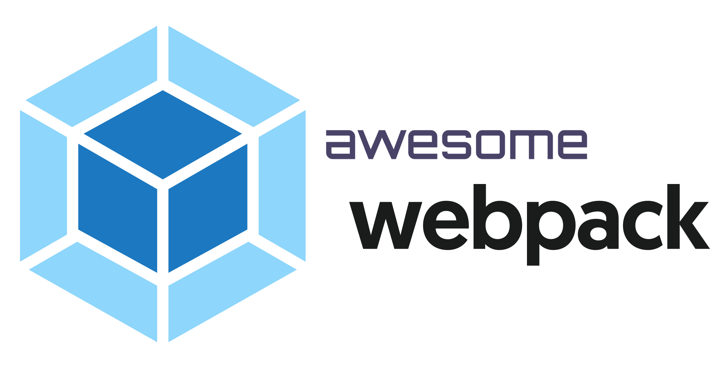
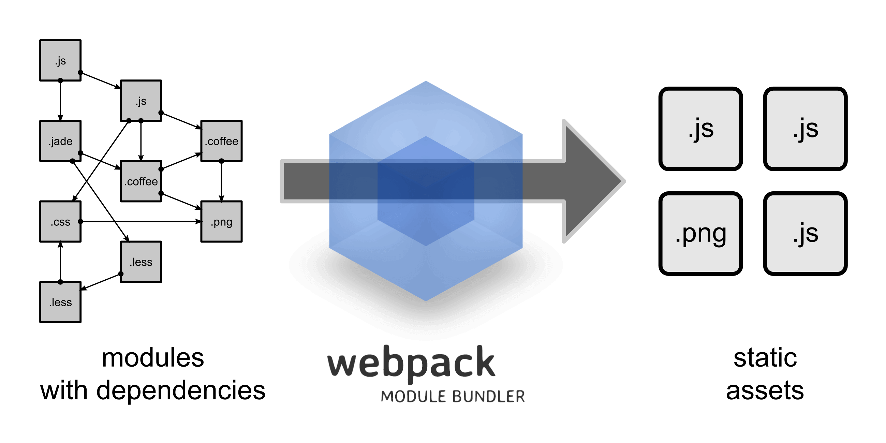

# Webpack



## TL;DR

- webpack은 모든 리소스들(javascript, css, images, fonts, etc)에 대한 dependency graph를 생성하여 빌드시켜주는 도구입니다.
- webpack은 require()를 사용하여 리소스들간의 의존성 관계를 형성시켜주며 어떻게 javascript를 bundling할 것인지 결정해 줍니다.
- Loader 가 존재하여 다른 리소스를 순수 JavaScript 로 변환하고 모든 리소스에 대한 모듈을 구성
- 모듈 간의 관계를 chunk 단위로 나눠 필요할 때 로딩
- 모듈 단위로 개발이 가능
- LESS, SASS(SCSS) 등 사용 가능
- ES6+ 자바스크립트를 사용
- 엔트리포인트를 시작으로 연결되어 었는 모든 모듈을 하나로 합쳐서 결과물을 만드는 것이 웹팩의 역할이다.

## 등장배경

- 서버 요청횟수를 최소화( 파일을 하나로 만든다.)
- 트랜스컴파일링(JSX, ts, ES6)
- 최적화(파일압축)
- Package Bundler(의존성,종속성을 가진 애플리케이션 모듈을 정적인 소스로 재생산)
- 의존성관리를 포함한 번들링 도구
- 사용하지 않는 코드 관리
- Dynamic Loading & Lazy Loading 미지원

모듈 번들러란 여러개의 나누어져 있는 파일들을 하나의 파일로 묶어주는(bundling) 라이브러리를 말한다.  
왜 파일을 하나로 만들까?  
웹페이지에 필요한 CSS, Script등이 자원들을 받기 위해 서버에 요청하는 횟수를 줄이기 위해서 자원을 하나로 만들기로함!  
또 최신 자바스크립트 문법을 구형 브라우저가 해석가능한 문법으로 변환하는 역할을 수행함.  
이밖에 파일압축, 최적화를 할 수있어 초기 로딩속도가 빨라진다.  
웹팩은 기본적으로 필요한 자원은 미리 로딩하는게 아니라 필요한 시점에 요청하자는 컨셉이다.

브라우저 환경에서 모듈 번들링의 도입과정에 대해 잘 소개한 글이 있어 첨부한다.  
[프론트엔드 개발환경의 이해](https://jeonghwan-kim.github.io/series/2019/12/10/frontend-dev-env-webpack-basic.html)

## 용어

1. 번들러
   번들러란 필요한 의존성에 대해 정확하게 추적하여 해당하는 의존성들을 그룹핑 해주는 도구
   Webpack은 웹페이지를 동작시키기 위한 서로 연관 관계가 있는 웹 자원들( js, css, img, webfont, etc.. )의 관계들을 번들링하게 되면 최종적으로 기존의 원본 파일들을 압축, 축소하여 최적화된 정적 자원(파일)으로 변환해주는 작업(웹페이지 성능 최적화)을 하게 되는데 이러한 작업을 번들링이라고 한다.

1. 번들

1. 청크

## 철학

- 모든 것으 모듈이다.  
  모든 웹 자원(js, css, html, img, webfont...)을 모듈 형태로 로딩이 가능합니다.  
  웹팩에서는 로더를 이용해 css, html, images등을 자바스크립트로 로딩 가능하도록 합니다.
- 초기에 불필요한 것을 모두 로딩하지 않고 필요할 때에 필요한 것만 로딩합니다.

## 주요 기능

### 자바스크립트 모둘화

- ES6의 모듈화문법, 웹팩의 모듈 번들링 이용

### 자바스크립트 일원화

- 프론트엔드 코드에 npm 패키지를 사용할 수 있습니다.

### HTTP 요청횟수 최적화

- 리소스 압축을 통해 서버 요청횟수를 줄인다.

### Dynamic Loading & Lazy Loading

- 코드를 압축 또는 최적화할 수 있습니다.
- 코드 스플리팅을 이용해 모듈을 원하는 타이밍에 로딩한다.
- CommonsChunkPlugin 자동생성

### NPM으로 JavaScript 리소스 일원화

### Webpack-dev-server 활용한 개발 편의성 증대

- Webpack 설정을 통해 Front-end만의 개발용 Node.js 서버를 손쉽게 구축하도록 돕는다.
- HMR (Hot Module Replacement)을 통해 수정된 사항을 브라우저에서 빠르게 확인할 수도 있다.(생산성 향상)
- 실질적으로 물리적인 파일을 Build해내는 것이 아니라, Memory내에 Cache 한 결과를 라우팅하기 때문에 watch를 통해 변경사항을 매번 빌드하는 것에 비해 쾌적한 개발 환경을 구축

## 주요개념

### entry

웹팩에서 모든 것은 모듈이다. 자바스크립트, 스타일시트, 이미지 등 모든 것들을 자바스크립트 모듈로 로딩해서 사용하도록한다.

  
위 그림처럼 자바스크립트가 로딩하는 모듈이 많아질 수록 모듈간의 의존성은 증가한다. 의존성 그래프의 시작점을 웹팩에서는 `엔트리(entry)`라고한다.

웹팩은 엔트리를 통해서 필요한 모듈을 로딩하고 하나의 파일로 묶는다.

**webpack.confing.js**

```js
module.exports = {
  entry: {
    main: "./src/main.js",
  },
};
```

우리가 사용할 html에서 사용할 자바스크립트의 시작점은 src/main.js코드다. entry키에 시작점 경로를 지정했다.

### output

`entry`에 설정한 자바스크립트 파일을 시작으로 의존되어 있는 모든 모듈을 하나로 묶을 것이다. 번들된 결과물을 처리할 위치는 `output`에 기록된다.

**webpack.confing.js**

```js
module.exports = {
  output: {
    filename: "bundle.js",
    path: "./dist",
  },
};
```

dist 폴더의 bundle.js파일로 결과를 저장할 것이다.  
html파일들에서는 번들링된 이 파일을 로딩하게끔 한다.

**index.html**

```html
<body>
  <script src="./dist/bundle.js"></script>
</body>
```

entry에 설정한 자바스크립트는 Util.js모듈을 사용한다.

**src/main.js:**

```js
import Utils from "./Utils";
Utils.log("Hello webpack");
```

Util.js의 코드는 다음과 같다.

**src/Utils.js:**

```js
export default class Utils {
  static log(msg) {
    console.log("[LOG] " + msg);
  }
}
```

웹팩은 터미널에서 `webpack`커맨트로 빌드할 수 있다.

## Loader

웹팩은 모든 파일을 모듈로 관리한다고 했다. 자바스크립트 파일 뿐만 아니라 이미지, 폰트, 스타일시트도 전부 모듈로 관리한다. 그러나 웹팩은 자바스크립트 밖에 모른다.
비 자바스크립트 파일을 웹팩이 이해하게끔 변경해야하는데 로더가 그런 역할을 한다.

로더는 *test*와 *use*키로 구성된 객체로 설정할 수 있다.

- test: 로딩할 파일을 지정한다.
- use: 적용할 로더를 설정한다.

### 1.Babel-loader

가장 간단한 예가 바벨이다. ES6에서 ES5로 바벨을 변활할 때 바벨을 사용할 수 있는데 test에 ES6로 작성한 자바스크립트 파일을 지정하고, use에 이를 변환할 바벨 로더를 설정한다.

마침 위 코드를 ES6로 작성했으니 로더를 이용해 ES5로 변환해 보자.

**webpack.config.js**

```js
module.exports = {
  module: {
    rules: [{
      test: //.js$/,
      exclude: 'node_modules',
      use: {
        loader: 'babel-loader',
        options: {
          presets: ['env']
        }
      }
    }]
  }
}
```

test에 자바스크립트 확장자를 갖는파일을 정규식으로 지정했다. node_modules 폴더는 패키지 폴더이므로 제외하기 위해 exepct에 설정한다. use에 로더를 정하는데 babel-loader를 추가했다.

로더를 사용하기 위해서는 노드 패키지로 제공하는 로더를 npm으로 추가해야한다.

```
npm i --save-dev babel-loader babel-core babel-preset-env
```

빌드하고 나면 bundle.js가 ES5문법으로 변경된것을 확인할 수 있다.

### CSS-loader, style-loader

예제를 하나 더 살펴보자. 웹팩은 모든 것을 모듈로 다루기 때문에 CSS파일을 자바스크립트로 변환해서 로딩해야한다. css-loader가 그런 역할을 하는 로더이다.

css-loader를 적용한 뒤 번들링하면 다음처럼 CSS코드가 자바스크립트로 변환된 것을 확인할 수 있다.

dist/bundle.js

```js
//module.
exports.push([module.i, "body {/n background-color: green;/n}/n", ""]);
```

이렇게 변경된 스타일 시트는 돔에 추가되어야만 브라우져가 해석할 수 있다. style-loader는 자바스크립트로 변경된 스타일시트를 동적으로 돔에 추가하는 로더이다.
보통 CSS를 번들링하기 위해서는 css-loader, style-loader를 함께 하용한다.  
 이때 로더의 적용 순서를 주의해야한다. 로더는 기본적으로 오른쪽에서 왼쪽으로 적용되는데 먼저 처리되어야하는 로더가 가장 오른쪽에 와야한다는 뜻이다. sass-loader를 사용하는경우
`use: ['stype-loader','css-loader','sass-loaer']`의 식으로 작성할 수 있다.

**webpack.config.js**

```js
module.exports = {
   module : {
       rules: [{
           test: //.css$/,
           use:['style-loader','css-loader']
       }]
   }
};
```

**src/sytle.css:**

```js
body {
    background-color: green;
}
```

## plugin

웹팩에서 알아야할 마지막 개념이 plugin이다. loader가 파일단위로 처리하는 반면 플러그인은 번들된 결과물을 처리한다. 번들된 자바스크립트를 난독화 한다거나 특정 텍스트를 추출하는 용도로 사용할 수 있다.

### UglifyJsPlugin

UglifyJsPlugin은 로더로 처리된 자바스크립트 결과물을 난독화 처리하는 플러그인이다.  
플러그인을 사용할 때는 웹팩 설정 객체의 plugins 배열에 추가한다.

```js
const webpack = require('webpack')

module.exports = {
    plugins: {
        new webpack.optimize.UglifyJsPlugin()
    }
}
```

### ExtractTextPlugin

CSS 전처리기인 사스(SASS)를 사용하려면 어떻게 처리해야할까? 기존의 CSS파일을 사스 파일로 변경해서코딩한 뒤 웹팩에서는 사스로더만 추가하면 될 것이다. 이 역시 bundle.js파일에 포함될 것이다.

만약 사스 파일이 매우 커진다면 분리하는 것이 효율적일 수 있다. bundle.js 파일이 아니라 style.css파일로 따로 번들링 한다는 말이다. 이때 사용한는 것이 ExtractTextPlugin이다.

우선 사스로더부터 적용해보자.

**webpack.config.js**

```js
module.exports = {
  module: {
    rules: [{
      test: //.scss$/,
      use: ['style-loader', 'css-loader', 'sass-loader']
    }]
  }
};
```

로더의 test키에 scss를 확장자로 갖는 파일로 지정한뒤 기존 로더에 sass-loader를 추가했다.

사스 파일은 아리와 같이 만들었다.

src/sytle.scss:

```
$bg-color: green;

body {
  background-color: $bg-color;
}
```

그리고 이 사스파일을 사용할 main.js에서 로딩했다.

src/main.js

```js
import Utils from "./Utils";

require("./style.scss"); // sass 로딩

Utils.log("Hello webpack");
```

여기까지 설정한뒤 번들링하면 bundle.js파일이 생성되고 설정한코드는 이 파일에 함께 포함되어 있을 것이다.
이제 별도의 CSS로 분리하기 위해 ExtractTextPlugin 플러그인을 사용할 차례이다.

**webpack.config.js**

```js
const ExtractTextPlugin = require('extract-text-webpack-plugin')

module.exports = {
  module: {
    rules: [{
      test: //.scss$/,
      use: ExtractTextPlugin.extract({
        fallback: 'style-loader',
        use: ['css-loader', 'sass-loader']
      })
    }]
  },
  plugins: [
    new ExtractTextPlugin('style.css')
  ]
};
```

plugins 배열에 `new ExtractTextPlugin('style.css')` 객체를 추가했다. style.css로 번들링하겠다는 의도다.

UglifyJsPlugin과는 다르게 로더쪽에 설정을 추가했다. 기존 로더를 제거하고 ExtractTextPlugin이 제공하는 extract()함수를 로더로 지정한다.

설정을 완료한 후 웹팩 실행결과 dist 폴더에는 bundle.js와 style.css파일이 생성되어 있을 것이다.

### REF

- [Webpack-Basic](https://jeonghwan-kim.github.io/series/2019/12/10/frontend-dev-env-webpack-basic.html)
- [WebpackTutorial\_한글](https://github.com/AriaFallah/WebpackTutorial/tree/master/ko-arahansa/part1)
- [(Webpack) 모듈? 번들링?](https://perfectacle.github.io/2016/11/18/Module-bundling-with-Webpck/)
- [왜 webpack인가](https://dev.zzoman.com/2017/09/04/why-do-you-need-to-learn-about-webpack/)
- [이해하기 쉬운 webpack](https://haviyj.tistory.com/17)
- [웹팩의 기본개념](http://jeonghwan-kim.github.io/js/2017/05/15/webpack.html)
- [웹팩 옵션](https://trustyoo86.github.io/webpack/2018/01/10/webpack-configuration.html)
- [웹팩 개념잡기](https://kdydesign.github.io/2017/07/27/webpack/)
- [웹팩 정복하기](https://kdydesign.github.io/2017/11/04/webpack-tutorial/)
- [웹팩 핸드북](https://joshua1988.github.io/webpack-guide/)

## 다뤄볼 내용

청크
캐시
빌드옵션 정리.
코드 스플리팅.
